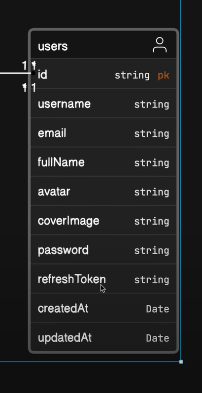

# Professional backend Setup:

1. We commence our project by creating a use model for it. Refer to picture one for a visual representation.



2. In the model, we observe that we handle images as part of our project.

3. During this phase, we establish our file and folder structure.

4. Initially, we initialize an empty Node application.

5. In our model, we also deal with images. It's crucial to note that when storing images, we utilize third-party services such as Microsoft Azure, Amazon AWS, and Cloudinary.

6. We narrow our focus when uploading photos or other media from users. We ensure that we store this media on our server to mitigate the impact in case of a sub-connection loss. This guarantees the presence of media on our server.

7. In the third process, we upload the photos to the third-party platform.

8. Some companies opt for a directed upload approach, while others use third-party packs. This choice depends on the specific practices of each company.

9. The concept of GitHub keep files is significant in our project.

10. Additionally, we consider the concept of GitHub ignore files.

11. Create a `.env` file.

12. Inside the project's root directory, create a `public` folder.

13. Within the `public` folder, create a `temp` folder.

14. Place the `.gitkeep` file inside the `temp` folder, allowing it to be pushed to GitHub without having extra files we make files in future initially we upload empty folder.

15. Create a `src` folder within the project's root directory.

16. Inside the `src` folder, create three files `app,js` `constants.js` `index.js`.

17. Address the issue of the server restarting repeatedly by exploring different options.

18. Install the `nodemon` dev dependency to handle server reloading upon changes.

19. Use the dev dependency installation process: insert a '-D' between `npm` and the package name, specifying it as a dev dependency.

20. Reload the server automatically when changes are made in the source files.

21. To achieve this, write a script for `nodemon` to execute.

22. Formulate the command for the script.

```js
  "scripts": {
    "dev": "nodemon src/index.js"
  },
```
21. Create additional folders within our source folder.

22. Utilize the following folders accordingly:

    - Controllers: Implement the majority of the application's functionality here.

    - Database: Write the connection logic for the database.

    - Middlewares: Implement middleware functions here.

    - Models: Handle data modeling in this folder.

    - Routes: Manage routes in this folder.

    - Utils: Store utility functions in this folder.

23. Install Prettier plugins so that we can work professionally in a team.

Developers use Prettier and its plugins to ensure a consistent and maintainable codebase, improve collaboration, and save time on manual code formatting. It has become a valuable tool in modern development workflows.

`.prettierrc`
The .prettierrc file is a configuration file used by the Prettier code formatter. It allows you to customize various formatting options to match the coding style preferences of your project. This file typically resides in the root directory of your project.

`.prettierignore`
The .prettierignore file is used to specify files and directories that should be excluded from Prettier formatting. It works similarly to the commonly used .gitignore file but is specific to Prettier.

```js
{
  "singleQuote": false,
  "bracketSpacing": true,
  "tabWidth": 2,
  "trailingComma": "es5",
  "semi": true
}```