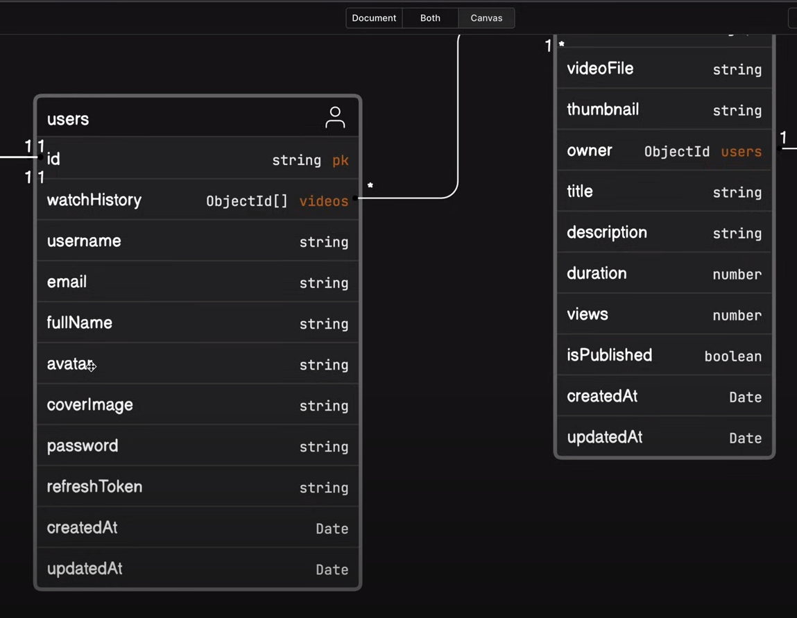

# Professional backend Setup:

1. We commence our project by creating a use model for it. Refer to picture one for a visual representation.


2. In the model, we observe that we handle images as part of our project.

3. During this phase, we establish our file and folder structure.

4. Initially, we initialize an empty Node application.

5. In our model, we also deal with images. It's crucial to note that when storing images, we utilize third-party services such as Microsoft Azure, Amazon AWS, and Cloudinary.

6. We narrow our focus when uploading photos or other media from users. We ensure that we store this media on our server to mitigate the impact in case of a sub-connection loss. This guarantees the presence of media on our server.

7. In the third process, we upload the photos to the third-party platform.

8. Some companies opt for a directed upload approach, while others use third-party packs. This choice depends on the specific practices of each company.

9. The concept of GitHub keep files is significant in our project.

10. Additionally, we consider the concept of GitHub ignore files.

11. Create a `.env` file.

12. Inside the project's root directory, create a `public` folder.

13. Within the `public` folder, create a `temp` folder.

14. Place the `.gitkeep` file inside the `temp` folder, allowing it to be pushed to GitHub without having extra files we make files in future initially we upload empty folder.

15. Create a `src` folder within the project's root directory.

16. Inside the `src` folder, create three files `app,js` `constants.js` `index.js`.

17. Address the issue of the server restarting repeatedly by exploring different options.

18. Install the `nodemon` dev dependency to handle server reloading upon changes.

19. Use the dev dependency installation process: insert a '-D' between `npm` and the package name, specifying it as a dev dependency.

20. Reload the server automatically when changes are made in the source files.

21. To achieve this, write a script for `nodemon` to execute.

22. Formulate the command for the script.

```js
  "scripts": {
    "dev": "nodemon src/index.js"
  },
```
21. Create additional folders within our source folder.

22. Utilize the following folders accordingly:

    - Controllers: Implement the majority of the application's functionality here.

    - Database: Write the connection logic for the database.

    - Middlewares: Implement middleware functions here.

    - Models: Handle data modeling in this folder.

    - Routes: Manage routes in this folder.

    - Utils: Store utility functions in this folder.

23. Install Prettier plugins so that we can work professionally in a team.

Developers use Prettier and its plugins to ensure a consistent and maintainable codebase, improve collaboration, and save time on manual code formatting. It has become a valuable tool in modern development workflows.

`.prettierrc`
The .prettierrc file is a configuration file used by the Prettier code formatter. It allows you to customize various formatting options to match the coding style preferences of your project. This file typically resides in the root directory of your project.

`.prettierignore`
The .prettierignore file is used to specify files and directories that should be excluded from Prettier formatting. It works similarly to the commonly used .gitignore file but is specific to Prettier.

```js
{
  "singleQuote": false,
  "bracketSpacing": true,
  "tabWidth": 2,
  "trailingComma": "es5",
  "semi": true
}
```


# How to connect database in MERN :

## Here we learnt about database connection:

Here, we're looking at different ways to connect to a database and how we deal with problems that may come up. 

We're using MongoDB as our database, specifically MongoDB Atlas, which is a cloud-based service provided by MongoDB. Just to be clear, we're not using a big, complicated database – we're going for MongoDB Atlas.


**What is MongoDB Atlas?**

MongoDB Atlas is like a super convenient and reliable home for your MongoDB databases. Imagine you have a bunch of information (like names, addresses, and other details) that you want to organize and store. MongoDB is a type of database that helps you do that. Now, MongoDB Atlas is a service that takes care of the tricky parts of managing that database, making it easier and more reliable.

**Key Points:**

1. **Cloud Hosting:** MongoDB Atlas lives on the internet (in the cloud). It's not a physical thing you have to set up in your office. This is great because it means your database can be accessed from anywhere, and you don't have to worry about maintaining hardware.

2. **Easy Setup:** Setting up a MongoDB database can be a bit technical, but with MongoDB Atlas, it's much simpler. You choose your preferences like how much storage you need, where you want it to be located (like in the US or Europe), and other settings.

3. **Automatic Updates:** Imagine your database is like a smartphone. You want it to have the latest features and be secure. MongoDB Atlas takes care of updating and fixing things in the background, so you don't have to worry about it.

4. **Backups and Security:** Atlas automatically keeps copies of your database in case something goes wrong. It also has security features to make sure only the right people can access your information.

5. **Scaling Made Easy:** If your business grows and you need more space or power for your database, Atlas can easily scale up to handle more data and traffic without causing you headaches.

6. **Monitoring and Alerts:** Atlas keeps an eye on your database's health. If something looks odd or there's a problem, it can send you a message (alert) so you can fix it before it becomes a big issue.

In simple terms, MongoDB Atlas is like having a reliable caretaker for your MongoDB database. It lives in the cloud, makes sure things run smoothly, and takes care of technical stuff so you can focus on using your data rather than worrying about managing the database.

### Create a Project in MongoDB Atlas

Certainly, let's relate the process of creating a project in MongoDB Atlas to familiar concepts:

1. **Create a Project:**
   - Think of creating a project in MongoDB Atlas like setting up a special workspace or folder on your computer. It's a place where you'll organize and manage all the data related to a specific task or goal.

2. **Name Your Project:**
   - Giving a name to your project is similar to naming a folder on your computer. It helps you quickly identify and remember what's inside.

3. **Add Members:**
   - Adding members means inviting other people (like teammates or collaborators) to join your project. In computer terms, it's like sharing access to a shared folder with specific people.

4. **Project Names Have to be Unique:**
   - Imagine if you had two folders with the same name on your computer – it would be confusing. MongoDB Atlas ensures that each project name is unique within your organization, just like each folder having a unique name on your computer.

In MongoDB Atlas, a project is a way to organize and manage databases, collections, and related resources. Creating a project is like creating a virtual space to neatly arrange and handle data for a specific purpose. It's part of the process that helps you structure and manage your database-related tasks efficiently.

### Deploy your database:

When you go to the "Deploy" section in MongoDB Atlas, it means you are entering a part of the platform where you can set up and configure the deployment of your MongoDB database. Let's break down what this typically involves:

1. **Cloud Provider and Region:**
   - Choose the cloud provider (e.g., AWS, Azure, GCP) where you want to host your MongoDB database.
   - Select the specific region or data center location within the chosen cloud provider's infrastructure. This impacts the physical location of your database servers.

2. **Cluster Configuration (Cluster Tier):**
   - Specify the type and size of your MongoDB cluster. This includes details such as the number of nodes, the type of storage, and the amount of RAM allocated to your cluster.

3. **Cluster Name:**
   - Give your MongoDB cluster a name for easy identification.

4. **Additional Settings:**
   - Depending on the cloud provider, you may have additional settings to configure, such as enabling backups, specifying the MongoDB version, or other provider-specific options.

5. **Cluster Connectivity:**
   - Configure network settings, such as IP whitelisting, to control which devices or services can access your MongoDB cluster. This is an essential security measure.

6. **Authentication and Authorization:**
   - Set up authentication mechanisms (e.g., username and password) to control who has access to your MongoDB cluster. You can also configure roles and permissions for more fine-grained access control.

7. **Cluster Tier and Disk Configuration:**
   - Depending on the chosen cluster tier, you may need to configure disk options, such as storage capacity and the type of storage (e.g., SSD).

8. **Review Configuration:**
   - Before deploying, review all the settings to ensure they align with your requirements and preferences.

9. **Deploy Cluster:**
   - Once you've configured everything, you can initiate the deployment process. MongoDB Atlas will then provision the necessary resources and set up your MongoDB cluster based on your specified configuration.

In essence, the "Deploy" section in MongoDB Atlas guides you through the process of specifying where and how you want your MongoDB database to be hosted. It covers various settings related to infrastructure, security, and performance to tailor the deployment according to your application's needs.

### Network Access Section:

Certainly! The "Network Access" section in MongoDB Atlas is like the bouncer at a club who decides who gets to come in. It's where you set the rules for who can connect to your MongoDB database.

Here's a breakdown in easy language:

1. **Access List Entry:**
   - This is like the VIP list. You specify which IP addresses or ranges are allowed to connect to your MongoDB database.
   - In the example you provided, `49.37.66.88/32` is on the list. It's a specific address or device that's allowed to access your MongoDB. Think of it like having a special invitation.

2. **Comment:**
   - This is like a little note to remind you why a certain IP address is on the list. In this case, it says it was created during the Auto Setup process, so you know it's there for a reason.

3. **ALLOW ACCESS FROM ANYWHERE:**
   - This is like saying, "Okay, everyone is invited!" It means any device or computer from anywhere can connect to your MongoDB database. While convenient, it's generally considered less secure because it opens the door to anyone.


In simpler terms, the "Network Access" section lets you decide who gets the keys to your MongoDB party. You can be specific and invite only certain IP addresses, or you can be more open and allow access from anywhere. It's a security feature that helps control who can interact with your MongoDB database.


### DataBase Access Section:

Absolutely, let's break down the "Database Access" section in MongoDB Atlas using simple language:

1. **Edit User: moazshamim1575@admin:**
   - Think of this like having a special key for a specific person named "moazshamim1575" who is the admin, meaning they have some powerful access rights.

2. **Authentication Method:**
   - This is the way MongoDB checks if the person trying to access the database is who they say they are. It's like choosing between a password, a certificate (a special kind of ID card), or other methods.

   - In this case, the authentication method chosen is "Password," so "moazshamim1575" needs to enter the correct password to get in.

3. **Database User Privileges:**
   - Imagine the user "moazshamim1575" as a guest at a party. The privileges are like the different things they can do at the party.

   - **Built-in Role:**
     - It's like giving "moazshamim1575" a specific role or job at the party. In this case, one role has been selected, maybe something like being the person who can look at and read things (SELECT).

   - **Custom Roles:**
     - These are special roles you can create yourself. It's like making up specific tasks or responsibilities for "moazshamim1575" at the party.

   - **Specific Privileges:**
     - This is like giving "moazshamim1575" certain special abilities or permissions. For example, they might be allowed to do specific things with certain parts of the party (database and collection). You can be very detailed about what they can and cannot do.

4. **Restrict Access to Specific Clusters:**
   - Imagine you're hosting multiple parties in different rooms. This option lets you decide which rooms "moazshamim1575" is allowed to enter.

   - By default, "moazshamim1575" can access everything in this project (the whole party), but you can enable this option to be more specific about where they can go.


In simpler terms, the "Database Access" section is where you decide who gets special access keys, how they prove they're allowed in, and what specific things they can do at the "party" (or database). It's like setting up security and permissions for different users.


### "Clusters" in MongoDB:

**Imagine a City of Databases:**
- Think of a "cluster" as a big city made up of many individual databases.
- Each database is like a separate house in the city, and all these houses together make up the entire cluster.

**City Infrastructure:**
- Just like a city has infrastructure (roads, electricity, water supply), a MongoDB cluster has its own infrastructure that helps databases communicate and work together.

**Roles in the City:**
- In the city, you have different roles like firefighters, police officers, and chefs. In a MongoDB cluster, you have different types of servers or nodes, each with its own role to play.

**Living Together:**
- All the databases in a cluster live together in harmony, just like people in a city. They share resources, help each other out, and make the entire city (or cluster) run smoothly.

**Why Clusters Are Useful:**
- Clusters provide a way to organize and manage lots of information. They ensure that even if one house (or database) has a problem, the rest of the city (or cluster) can still function well.

**Scaling Up:**
- If the city needs to grow, it can add more houses or buildings. Similarly, if your data grows, you can add more databases to your MongoDB cluster.

**Security and Access:**
- Just like cities have gates and guards for security, MongoDB clusters have measures to control who can access and interact with the databases.

**In Simple Terms:**
- A MongoDB cluster is like a busy and well-organized city where databases live, work together, and share resources to make sure everything runs smoothly. Each database is a part of the city, contributing to the overall functioning of the cluster.

### Connect to Cluster :

let's simplify the process of connecting to Cluster in MongoDB Atlas:

1. **Connect to Cluster:**
   - Think of "Cluster0" as a special place where your MongoDB databases live. Connecting to it is like getting the keys to the entrance.

2. **Set Up Connection Security:**
   - Just like having locks on your doors to keep things safe, setting up connection security is about making sure only the right people (or applications) can access your MongoDB data.

3. **Choose a Connection Method:**
   - Imagine you have different ways to enter a building – maybe through the front door, a side entrance, or even a secret passage. Choosing a connection method is like picking how you want to access your MongoDB data.

4. **Connect:**
   - Now, you're ready to actually open the door and go inside (connect). There are different tools or methods you can use:

   - **Access your Atlas data using MongoDB’s native drivers:**
     - This is like using a special key (driver) that MongoDB understands. It's a way for your software (like Node.js or Go) to talk to the MongoDB database.

   - **Access your data through tools:**
     - This is like using a magic tool to see and work with your data. You can choose from different tools based on what you're comfortable with or what suits your needs.

   - **Data Explorer, Compass, Shell, MongoDB for VS Code, Atlas SQL:**
     - These are like different doors or entrances you can use to interact with your MongoDB data. Each one has its own features, like a Data Explorer for browsing, Compass for visualizing data, Shell for quick commands, VS Code for developers, and Atlas SQL for connecting with SQL tools.

   - **Go Back and Close:**
     - If you change your mind or finish what you were doing, you can go back or close the connection, just like leaving a building and locking the door behind you.

In simple terms, connecting to Cluster is like entering a secure place where your MongoDB data is stored. You can choose how you want to get in, use different tools to explore and work with your data, and when you're done, you can leave or close the connection.

### Connecting with MongoDB Compass:

When you click Connecting with MongoDB Compass , MongoDB Atlas provide you a connection string from which you connect to your Clusters(DataBase)

The connection string you see is like a secret code that helps your computer talk to the MongoDB database in the cloud (Cluster0). Let's break it down:

1. `mongodb+srv://`: This is just a way of saying, "Hey, I want to connect to a MongoDB server!"

2. `moazshamim1575`: This is the username you'll use to log in.

3. `<password>`: You need to replace this with the actual password for the user 'moazshamim1575'.

4. `@cluster0.gwa9zwr.mongodb.net/`: This is the address of the MongoDB server. It's like telling your computer where to find the database. In this case, it's Cluster0 in the MongoDB cloud.

So, when you put it all together, it's like telling your computer, "Connect to MongoDB using the username 'moazshamim1575', with this password, and find the database in Cluster0 in the MongoDB cloud."

Make sure to replace `<password>` with the real password, and then you can use this code to connect your computer to the MongoDB database!

You can use this connection string in the env file of your project to connect your project from DataBase. 


## Now, let's delve into our codebase and learn how we connect to the database.

First, navigate to the environment variable file env and include all the necessary variables such as PORT, DB_URI, and others.

Next, define the database name in a constants file and export it. Placing it in the constants file allows for easy modification in the future. If the file name needs to be changed later, this modification can be done in one place, affecting every instance where this database name is used.
 
### database connection approach:

There are two major ways of connecting to a database in Node.js:

1. **Single File Approach:**
   In this method, all the code and functionality are defined in the index file. The index file is typically the first one executed through nodemon.

2. **Modular Approach:**
   Here, a dedicated database folder is created, and all connection logic and functions are defined in a separate file within that folder. Afterward, this function is imported into the index file and executed there.

   - By writing code in separate files, the codebase becomes cleaner, modular, and well-distributed.

Now, let's install some dependencies like 'env' and 'Express Mongoose.'

Moving to our `index.js`, we'll connect to the MongoDB database using Mongoose.

### For the database connection, consider the following two important points:

1. Whenever interacting with your database, it's crucial to handle potential problems. The solution is to wrap the database interactions in a try-catch block/promises provides a better approach for error handling.

2. Since databases are often located in different continents, communication takes time. To manage this delay, it's advisable to utilize asynchronous programming concepts like async-await when interacting with the database.

**Now, let's explore the first approach,**

where we consolidate all the code and functionalities for the database connection in the index.js file. Here, we utilize an Immediately Invoked Function Expression (IFE) to define our function.

At times, we observe the use of listeners in Express to ensure the assurance of the database connection.

**Next, we delve into the second approach.** 

Here, we organize all the code and functionalities for the database connection in a separate folder, like the 'db' folder. We then import and execute that functionality in the index file. To implement this, navigate to the 'db' folder and create an index.js file.

In Node.js, you have access to the process, and you can utilize it without the need for importing. The key point is that the process is a reference to the current running instance.

You can manage your process using the `exit` method, allowing you to gracefully terminate your application with different exit codes.

When you connect to a database through Mongoose using the `connect` method, it provides a return object that you can store in a variable.

This returned object is a response object, indicating a successful connection to the database.

We store the returned object in a variable named `connectionInstance`. This variable holds the result of the `mongoose.connect` operation, representing the connection instance.

To extract the host information from the connection instance, you can use `connectionInstance.connection.host`.

It's crucial to consolidate practices to avoid accidentally connecting to different hosts. For example, during development and testing, the database provider may offer different hosts than the production host. This way, by checking the `connectionInstance.connection.host`, you can easily determine the current host to ensure you are connected to the intended environment.

***

**Now, let's proceed to the index.js file in the src folder, where we import and utilize the connection functionality.**

Here we discuss the concept of environment variable env

We know that these are environment variable we need them everywhere as our application load as early as possible 

We can import the 'env' dependency by simply using the CommonJS `require` method and configuring its path where it is available. However, this CommonJS `require` method disrupts the consistency of our preferred practice of using ES6 module import syntax.

To overcome this, we can apply an experimental feature in the package.json file so that we can use ES6 module import syntax.

For that, we go to the package.json file and navigate to where you write the "dev" script. After that, you can specify that you want to use the experimental feature by using the flag syntax "-r".

"scripts": {
    "dev": "nodemon -r dotenv/config --experimental-json-modules src/index.js"
  },

***

 ### `connectedDB`

"Remember that we created a `connectedDB` function asynchronously, so we use `dot then` and `catch` from where we call `connectdb`. we call it in root index.js 

Keep in mind that when an asynchronous task is completed, it returns promises."

Here in the .then  part of the promise we use express event listeners for errors and also we start a server by using a listen method  

```javascript
app.on("error", () => {
  console.log("Express Error ::App DataBase Connection  :: error", error);
  throw error;
});
```

This code is setting up an event listener for errors in the Express application. Let's go through each part:

1. **`app.on("error", () => {...}`:**
   - This line is saying, "Listen for the 'error' event on the Express app." In programming, an event is like a signal that something specific has happened.

2. **`console.log("Express Error ::App DataBase Connection  :: error", error);`:**
   - When an error event occurs, this line logs a message to the console. The message includes information about the type of error, like "Express Error ::App DataBase Connection," and the details of the error.

3. **`throw error;`:**
   - This line throws an error, which means it stops the normal flow of the program and jumps to the nearest error-handling code (like a `catch` block if it's inside a `try-catch` statement).
   - Throwing an error is a way of saying, "Something unexpected happened, and we can't continue as usual."

In simple terms, this part of the code is saying, "If there's an error in the Express application, log the details of the error, and then stop everything because we can't proceed safely." It's a way to catch and handle errors in the application so that developers can be aware of issues during development or maintenance.

# Now we go to the documentation of ExpressJS we mainly focus on two things in the docs first is request and second is response 

**`req` object in Express.js:**

In Express.js, when your server receives a request (like someone visiting a webpage or making an API call), it gets a special object called `req`, which stands for "request." This object has a bunch of information about the request, and it's like a package that holds details about what the person or system is asking for.

Here are the key points:

1. **HTTP Request Information:**
   - The `req` object contains information about the request. This includes things like what URL was requested, any data that was sent along (like in a form or in the body of the request), and details about the type of request (GET, POST, etc.).

2. **Properties of the `req` Object:**
   - The `req` object has various properties that give you specific information about the request. For example:
     - `req.params`: This holds any parameters in the URL. In the example, `req.params.id` would give you the value of `id` from the URL.
     - `req.query`: This contains any parameters in the query string of the URL.
     - `req.body`: If the request includes data in the body (common in POST requests), you can access it through `req.body`.

3. **Callback Function Parameters:**
   - When you create routes in Express, you often define a function (callback) to handle what should happen when that route is accessed. In that function, you can name the `req` object whatever you like. Conventionally, it's named `req`, but you can call it anything. The important part is the information it carries.

4. **Enhanced Version of Node's Request Object:**
   - The `req` object in Express is like a supercharged version of Node.js's own request object. It has additional features and methods that make it easier to work with when building web applications.

In simpler terms, when someone asks your server for something (like a webpage or data), the server gets a special package called `req` that tells it exactly what the person wants and provides all the details needed to handle that request. Developers can then use the information in the `req` object to customize their server's response.

***

**We mainly focus on some `property of the request object`  in like a request.params, request.body, request.cookies**

**Let's break down the concept of `req.params property of the request object`  in Express.js in easy language:**

In Express.js, when your server receives a request, it often includes information in the URL. The `req.params` is like a special box that holds these pieces of information, specifically the parts of the URL that are defined as parameters.

Here are the key points:

1. **URL Parameters:**
   - When you define a route with parameters in Express, like `/user/:name`, it means that someone can visit a URL like `/user/tj`. The `req.params` object holds these values.

2. **Properties in `req.params`:**
   - If you have a route like `/user/:name`, then `req.params.name` will give you the value of the `name` parameter. In the example, if someone visits `/user/tj`, `req.params.name` will be "tj".

3. **Regular Expressions and Capture Groups:**
   - If you use a regular expression in your route definition or have wildcard matches, like `/file/*`, the captured values are available in the `req.params` array. For example, if someone requests `/file/javascripts/jquery.js`, `req.params[0]` will be "javascripts/jquery.js".

4. **Changing `req.params`:**
   - If you need to make changes to a key in `req.params`, you can use the `app.param` handler. However, these changes only affect parameters already defined in the route path.

5. **Automatic Decoding:**
   - Express automatically decodes the values in `req.params`. This means that if values are URL-encoded (e.g., spaces represented as `%20`), Express decodes them to their original form.

6. **Middleware and Route Handler Reset:**
   - Any changes made to the `req.params` object in a middleware or route handler will be reset after the request is processed. It's like a temporary space used during the handling of a specific request.

In simpler terms, `req.params` is like a box that holds pieces of information from the URL. It's useful when you want to capture specific values (parameters) from the URL and use them in your server logic.

***

**Let's break down the concept of `req.body property of req object` in Express.js and body-parsing middleware in easy language:**

In Express.js, when someone sends data to your server (for example, when submitting a form on a website), that data is often included in the request body. The `req.body` is like a container that holds all the key-value pairs of this submitted data.

Here are the key points:

1. **Submitted Data:**
   - When someone interacts with your website or application, they might submit data, like filling out a form or sending information. This data is sent in the request body.

2. **`req.body` in Express:**
   - The `req.body` object in Express holds all the data submitted in the request body. It's like a bag that keeps all the information neatly organized.

3. **Default Value and Middleware:**
   - By default, when a request arrives, `req.body` is undefined. To populate it with the submitted data, you need to use body-parsing middleware. Middleware is like a set of tools that help process incoming requests.

4. **Validation is Important:**
   - Since the data in `req.body` comes from users who can manipulate it, it's essential to validate it before trusting or using it in your application. Validation ensures that the data is in the expected format and prevents potential issues.

5. **Example Using Middleware:**
   - The provided example shows how to use two popular body-parsing middleware packages: `body-parser` and `multer`. These packages help parse different types of data, such as JSON and form-urlencoded data.

   - In the example:
     - `bodyParser.json()` is for parsing JSON data.
     - `bodyParser.urlencoded({ extended: true })` is for parsing form-urlencoded data.
     - `multer()` is for parsing multipart/form-data, often used for file uploads.

   - The `app.post('/profile', upload.array(), ...)` route is an example where data is posted to the server, and `console.log(req.body)` prints the submitted data to the console.

In simpler terms, `req.body` is like a container that holds all the information someone sends to your server. To use this data effectively, you need to use middleware tools like `body-parser` and `multer`. Always validate the data in `req.body` to ensure it's safe and in the expected format.

***

**Let's break down the concept of `req.cookies property of req object` in Express.js with the help of the `cookie-parser` middleware:**

When someone visits a website, the server can send back small pieces of data to be stored on the visitor's browser. These are called cookies, and they help the server remember information about the user. The `req.cookies` in Express.js is like a container that holds these cookies when the server receives a request.

Here are the key points:

1. **Cookies and `cookie-parser`:**
   - Cookies are tiny pieces of data sent by a website and stored on the user's browser. They can contain information like user preferences or session details.
   - To work with cookies in Express, developers often use a middleware called `cookie-parser`.

2. **`req.cookies` Object:**
   - When the `cookie-parser` middleware is used, the `req.cookies` object is created. It's like a collection that stores all the cookies sent by the user's browser.

3. **Accessing Cookie Values:**
   - You can access specific cookie values using the cookie's name as a property of `req.cookies`. For example:
     ```javascript
     // If the request includes a cookie named 'name'
     console.dir(req.cookies.name); // Outputs the value of the 'name' cookie
     ```

4. **Handling Signed Cookies:**
   - If cookies are signed for additional security, you should use `req.signedCookies` instead of `req.cookies`. Signed cookies are cookies that have been encrypted, and they are verified by the server.

5. **Example:**
   - If a user sends a request with a cookie like `Cookie: name=tj`, `req.cookies.name` will give you the value "tj".

In simpler terms, `req.cookies` is like a bag that holds all the cookies a user sent with their request. These cookies can contain information that helps the server remember things about the user. Using `cookie-parser` middleware makes it easy to work with these cookies in your Express.js application.

***

**Configuring in Express**

Configuring in Express refers to setting up or adjusting various settings and options for your Express application. It involves providing specific instructions to customize the behavior and functionality of your server.

In simpler terms, when you configure your Express application, you are telling it how to handle certain aspects, such as:

1. **Middleware:** You configure which middleware functions should be used and in what order. Middleware functions can handle tasks like logging, data parsing, authentication, etc.

2. **Routes:** You set up routes to define how your application responds to different types of requests. Each route is configured to handle specific HTTP methods and paths.

3. **Settings:** You can configure various settings for your application, such as the view engine, static file directories, and more.

4. **Environment:** Express allows you to configure your application differently based on the environment it's running in (development, production, testing).

Configuring in Express is about tailoring your application to behave the way you want it to, based on your specific requirements and preferences. It provides a flexible and customizable framework to build web applications.

***

**parsing in Express**

In the context of Express, parsing usually refers to the process of extracting and interpreting data from incoming requests. When a client sends data to your server, it's often in the form of a request, and this data needs to be understood by your server.

For example, when you submit a form on a website, the data from that form (like the information you typed into text fields) needs to be "parsed" by Express. Express uses middleware (like `body-parser` or the built-in `express.json()` middleware) to parse this incoming data and make it accessible to your server-side code.

So, parsing in Express is like unwrapping the data sent from a client so that your server can understand and work with it easily.


***

**middleware in Express**

In Express, middleware is like a set of tools or functions that help process and manage incoming requests and outgoing responses. Imagine a request is like a package traveling through a series of stops (middlewares) before reaching its final destination (your application's route handler).

Middleware functions have access to the request object (`req`), the response object (`res`), and the `next` function in the application’s request-response cycle. They can perform tasks such as modifying the request or response, ending the request-response cycle, and calling the next middleware in the stack.

Here's a simple analogy: think of your Express application as a highway for requests. Middleware acts like toll booths along the highway. Each toll booth can inspect, modify, or even block the incoming cars (requests) before allowing them to proceed further down the highway.

Common uses for middleware include handling data parsing, logging, authentication, and more. They enhance the functionality and structure of your Express application by breaking down tasks into manageable and reusable components.

***

**various properties and methods in Express for configuration**

In Express, configuration is often done through various properties and methods. Some commonly used properties for configuring an Express application include:

1. **`app.set(name, value)`**: This method is used to set application-level settings. For example:
   ```javascript
   app.set('view engine', 'ejs');
   ```

2. **`app.use([path,] callback [, callback...])`**: The `app.use()` method is used to mount middleware functions. Middleware functions are a way to configure how your application handles requests. For example:
   ```javascript
   app.use(express.json());
   ```
   app.use(): This is a method in Express that is used to set up middleware functions. Middleware functions are like helpers that can perform tasks when a request comes in.

3. **`app.locals`**: An object that can be used to store variables that are local to the application. These variables can be accessed within templates or route handlers.

4. **`app.engine`**: Configures the template engine for rendering views. For example:
   ```javascript
   app.engine('html', require('ejs').renderFile);
   ```

5. **`app.set('env', 'development')`**: Sets the environment mode for your application. The environment can be 'development', 'production', or 'testing', and certain configurations may vary based on the environment.

These are just a few examples, and the choice of properties/methods depends on what aspect of the application you are configuring (e.g., middleware, views, environment, etc.). The official Express documentation is a great resource for understanding all available options for configuration: [Express Application settings](https://expressjs.com/en/api.html#app.settings).

***

## Now we install and discuss on some packages like cookie parser and CORS:

_We use , app.use(): This is a method in Express that is used to set up middleware functions. Middleware functions are like helpers that can perform tasks when a request comes in._

"We import CORS and Cookie Parser in the `app.js` file. Now, let's review the CORS configuration. Additionally, we'll examine some settings before the cookie options."

Certainly! Let's break down the provided code in easy language:

```javascript
app.use(
  cors({
    origin: process.env.CORS_ORIGIN,
    credentials: true,
  })
);
```

This code is configuring Cross-Origin Resource Sharing (CORS) for an Express.js application. Let's understand what each part does:

1. **`app.use(cors({ origin: process.env.CORS_ORIGIN, credentials: true }))`:**
   - This line tells Express to use the `cors` middleware for all routes in the application.
   - `cors` is a middleware that helps in handling CORS-related issues, allowing or restricting access to resources on your server from different origins (websites).
  
2. **`origin: process.env.CORS_ORIGIN`:**
   - The `origin` option in `cors` determines which origins (websites) are allowed to access the resources on your server.
   - `process.env.CORS_ORIGIN` refers to an environment variable that should contain the allowed origin. This allows you to dynamically set the allowed origin based on your environment.

3. **`credentials: true`:**
   - The `credentials` option is set to `true`. This means that the server allows the browser to include credentials (like cookies or HTTP authentication) in the cross-origin request.
   - It's essential when your application involves authentication or when you want to send and receive cookies across different domains.

In simple terms, this configuration is saying:
- Allow requests from the origin specified in the `CORS_ORIGIN` environment variable.
- Allow credentials to be included in cross-origin requests.

By using this setup, the Express application is ready to handle cross-origin requests in a secure and controlled manner, ensuring that only specified origins are allowed, and credentials can be included when necessary.

***

If you set `CORS_ORIGIN` to `"*"` (wildcard) in your environment variable, it means that you are allowing any origin to make cross-origin requests to your server. Let's break down the implications:

```javascript
app.use(
  cors({
    origin: process.env.CORS_ORIGIN,
    credentials: true,
  })
);
```

1. **`origin: process.env.CORS_ORIGIN`:**
   - In this case, `process.env.CORS_ORIGIN` would be set to `"*"` (wildcard), meaning any origin is allowed to access your server's resources.

2. **`credentials: true`:**
   - Despite using a wildcard for the origin, you have set `credentials` to `true`, which means the server allows the inclusion of credentials (like cookies or HTTP authentication) in the cross-origin request.

Implications:
- **Any Origin Allowed:** Allowing any origin (`"*"`) can be a security risk, as it opens up your server to potential abuse from any website. This is generally not recommended unless you have a specific reason for it.

- **Credentials Allowed:** Allowing credentials with a wildcard origin might introduce security vulnerabilities, as it permits any website to send and receive sensitive information like cookies. Be cautious with this setting, especially if your application involves authentication.

- **CORS Security:** Cross-Origin Resource Sharing (CORS) is a security feature implemented by web browsers to restrict web pages from making requests to a different domain than the one that served the web page. While using a wildcard allows any origin, it might not adhere to the best security practices.

In summary, using `CORS_ORIGIN = "*"` allows any website to access your server's resources, and it's important to carefully consider the security implications, especially if your application involves sensitive data or authentication. It's usually recommended to specify specific origins rather than using a wildcard, whenever possible.

***
**"We know that in our backend, data comes from various sources such as URLs, JSON requests, and bodies like form submissions. Here, we'll discuss some good practices to handle all these situations."**


**Now we do some configuration and set up middlewares**


***When we get data in JSON format***

Certainly! In easy language, `app.use(express.json({limit: "16kb"}))` in Express is like setting a rule for your server to handle incoming data.

- **`express.json()`**: This is a middleware in Express that helps your server understand and work with data that comes in JSON format. For example, when someone submits a form on a website, the data is often sent in JSON format.

- **`{limit: "16kb"}`**: This part is setting a limit on how big that JSON data can be. In this case, it's saying, "Hey, if someone sends JSON data to my server, make sure it's not larger than 16 kilobytes (16kb)."

So, this line is essentially saying, "Use the middleware to handle JSON data, but don't accept JSON data larger than 16kb." It's a way to control the size of the data your server is willing to accept in a JSON format.


***
***When we get data through URL***

Sure, let's break down `app.use(express.urlencoded({extended: true, limit: "16kb"}))` in easy language:

- **`express.urlencoded()`**: This is another middleware in Express. It helps your server handle data when it comes from HTML forms. When you submit a form on a website, the data is usually sent as URL-encoded data.

- **`{extended: true, limit: "16kb"}`**: Here, you are setting some options for how the server should handle this URL-encoded data.
  - `extended: true`: This option allows for parsing complex objects in the URL-encoded data.
  - `limit: "16kb"`: Similar to the previous explanation, it sets a limit on the size of the data to 16 kilobytes (16kb).

So, this line is saying, "Use the middleware to handle data from HTML forms, and allow for parsing complex objects in the form data. Also, don't accept form data larger than 16kb." It's a way to control how your server processes and limits the size of form data from incoming requests.

***
**When we send static file to server**


Absolutely, let's break down `app.use(express.static("public"))` in easy language:

- **`express.static("public")`**: This is a middleware in Express that helps serve static files, like HTML, CSS, images, or JavaScript, directly to the client without any special handling.

- **`"public"`**: This part specifies the folder name where your static files are stored. In this case, it's saying, "Hey, all the static files are in a folder named 'public'."

- **`app.use()`**: This is how you tell your Express application to use this middleware. It's like saying, "Whenever there's a request for a static file, check the 'public' folder and send it to the client."

So, this line is essentially saying, "Use the middleware to serve static files from the 'public' folder to anyone who requests them." It's a convenient way to make your static files accessible to users when they visit your website.

***

**app.use(cookieParser())**

Certainly! Let's break down `app.use(cookieParser())` in easy language:

- **`cookieParser()`**: This is a middleware in Express that helps your server deal with cookies. Cookies are small pieces of data that a website can send to a user's browser, and the browser stores this data for future requests.

- **`app.use()`**: This is how you tell your Express application to use the cookie parser middleware. It's like saying, "Whenever there's a request, check if there are any cookies, and if there are, make them easy to work with."

So, this line is essentially saying, "Use the cookie parser middleware to handle and parse any cookies that come with the requests." It makes dealing with cookies in your Express application much simpler.


## Now we learn the concept of middleware's:

1. Previously, you wrote a code with `app.get()` where inside, a callback function was explained. This function details how to send a response when someone visits the server.

2. Understanding this concept is crucial because it forms the foundation for learning about middleware.

3. When a client hits a specific URL, like `/moaz`, your server is instructed to send a response using `res.send()`.

4. However, it's not as straightforward as just sending a response. There is some processing involved. You don't want everyone who visits your URL to get a response. Therefore, checks are implemented.

5. These checks are known as `middlewares`. They act as intermediaries between the incoming request and the server's response. 

6. In the case of your example, the middleware checks if the requester is authenticated. If they are, the server proceeds with sending the response; otherwise, access may be denied.

_The next in the img2 to is related to middleware next is only a flag when the work of first middleware is completed then it pass the flags to next mideliver and last is send response._

## Now we set up some of our utilities that help us to create a clean codeflow:

"We consistently interact with the database in various controllers, such as the user controller or video controller. Writing database connection and configuration code each time can be repetitive. To address this, we create a utility file to house a generalized function. This function allows anyone wanting to communicate with the database to pass their specific function to our utility. The generalized function then executes the database configuration code and functions, returning the result.

This practice is common in the industry. You can create this utility inside a 'service' folder, and you're free to name it as you prefer.

In our example, we've created an `asynchandler.js` file in the 'utils' folder to house this utility. The utility accommodates both promise and async/await methods, as database connections can take time. We cover both methods to cater to different preferences in the development process."

***

**1st async/await method**

Certainly! Let's break down the `asyncHandler` function in easy language:

```javascript
const asyncHandler = (fn) => async (req, res, next) => {
  try {
    await fn(req, res, next);
  } catch (error) {
    res.status(err.code || 500).json({
      success: false,
      message: err.message
    });
  }
};
```

1. **`const asyncHandler = (fn) => async (req, res, next) => { ... }`**:
   - This creates a function called `asyncHandler`.
   - It takes another function (`fn`) as an argument.
   - It returns a new function that accepts `req`, `res`, and `next` parameters.

2. **`try { await fn(req, res, next); }`**:
   - Inside this function, it tries to execute the provided function (`fn`) with `await`.
   - The `await` keyword is used with asynchronous functions to wait for them to complete before moving on.

3. **`catch (error) { ... }`**:
   - If there's an error during the execution of the function, it catches the error.
   - It then sends a JSON response with an appropriate status code (taken from the error's `code` property or defaulting to 500) and a message indicating the failure.

So, in simpler terms, `asyncHandler` is a utility function that helps handle asynchronous functions used in Express middleware. It wraps the provided function, catches any errors that occur during its execution, and sends a meaningful JSON response if there's an error. This helps to centralize error handling for asynchronous operations in your Express application.


***
**res.status(code)**

1. **HTTP Status:**
   - When your server responds to a request, it includes an HTTP status code in the response. This code indicates the outcome of the request—whether it was successful, encountered an error, or needs further action.
  
2. **`res.status(code)`:**
   - In Express.js (a web application framework for Node.js), when you handle a request, you use the `res` (response) object to send a response back to the client.
   - The `res.status(code)` method is used to set the HTTP status code for that response.

3. **Chainable Alias:**
   - The term "chainable" means you can chain this method with other methods.
   - For example, you might want to set the status code and send a message in the same line of code.
   - Chaining allows you to perform multiple operations on the response object in a single statement.

4. **Node’s Alias:**
   - It's mentioned as an "alias of Node’s" because Express.js is built on top of Node.js, and it often exposes methods that have aliases or similar functionalities from the underlying Node.js core.

In simple terms:
- `res.status(code)` is a way to tell the client about the outcome of their request.
- You can chain it with other methods to streamline your code.
- It's similar to how Node.js itself handles HTTP responses, and Express.js provides a convenient way to work with it.

***

Certainly! Let's break down `res.status(err.code || 500).json({ success: false, message: err.message });` in easy language:

1. **`res.status(err.code || 500)`**:
   - This part sets the HTTP status code for the response.
   - It uses `err.code` if it exists, otherwise defaults to 500 (Internal Server Error).
   - It's like saying, "Set the HTTP status code based on the error code, or use 500 if there is no specific error code."

2. **`.json({ success: false, message: err.message })`**:
   - This part sends a JSON response with two properties: `success` and `message`.
   - `success: false` indicates that the operation was not successful.
   - `message: err.message` provides a descriptive message about the error.

So, in simpler terms, this line of code is creating a response that communicates whether an operation was successful or not. If there's an error, it sets an appropriate HTTP status code and sends a JSON response with details about the error, including a descriptive message.

***

**2nd promise method**

Certainly! Let's break down the `asyncHandler` function in easy language:

```javascript
const asyncHandler = (requestHandler) => {
  (req, res, next) => {
    Promise.resolve(requestHandler(req, res, next))
      .catch((err) => next(err));
  }
};
```

1. **`const asyncHandler = (requestHandler) => { ... }`**:
   - This creates a function called `asyncHandler`.
   - It takes another function (`requestHandler`) as an argument.

2. **`(req, res, next) => { ... }`**:
   - This is an anonymous function that takes three parameters: `req` (request), `res` (response), and `next` (a function to pass control to the next middleware/route).

3. **`Promise.resolve(requestHandler(req, res, next))`**:
   - It takes the result of calling `requestHandler(req, res, next)` and wraps it in a resolved Promise.
   - This is useful for handling asynchronous operations.

4. **`.catch((err) => next(err))`**:
   - If there's an error during the execution of `requestHandler`, the `catch` block is triggered.
   - It calls `next(err)`, which passes the error to the next middleware or route in the sequence.

So, in simpler terms, `asyncHandler` is a utility function that wraps around another function (`requestHandler`). It ensures that any errors that occur during the execution of `requestHandler` are caught and passed to the next middleware or route. This is especially useful when dealing with asynchronous code.

## Now we discuss one more topics about structuring the custom api error and response 

**Structure the api error**

1. **Dealing with Database Connection and Requests:**
   - When we work with databases or handle various scenarios on the server, things might not always go as planned. There can be errors, unexpected situations, or issues that need attention.

2. **Handling Errors:**
   - To handle errors effectively, it's a good practice to structure error responses in a consistent way. This means defining how errors are formatted and communicated back to the client.

3. **Structured Error in One File:**
   - Instead of scattering error handling code throughout our project, it's more organized to centralize error structures in one file. This file contains classes or functions that help us create standardized error responses.

4. **Node.js API Errors:**
   - Node.js provides a set of built-in classes and methods for handling errors. This is known as the Node.js API for errors.

5. **Separate Classes:**
   - In your project, you create separate classes for different types of errors. These classes extend the built-in Node.js error classes.

6. **Overwriting Methods:**
   - By extending the Node.js error classes, you can customize and overwrite specific methods. This allows you to add additional information or modify the behavior of these errors to suit your application.

In simpler terms:
- When things go wrong in our server (like with databases), we need to communicate errors to clients in a structured way.
- To do this, we create a centralized file that defines how errors are formatted.
- Node.js has built-in error handling tools that we can extend and customize to fit our needs.
- We create separate classes for different types of errors and tweak them as necessary.
- This approach helps keep error handling organized and consistent throughout our code.


Certainly! Let's break down the concept of the `Error` class in easy language:

In JavaScript, an `Error` is like a special object that represents something going wrong in your code. It helps you identify and handle problems that might occur while your program is running. Here are the key points:

1. **What is the `Error` Class?**
   - The `Error` class is a fundamental part of JavaScript that helps you deal with errors in your code. When something unexpected happens, you can use an `Error` object to capture information about what went wrong.

2. **Creating an `Error` Object:**
   - You can create a new `Error` object using the `new Error()` syntax. When you create it, you can provide a message that describes the error. For example, you might say "Hey, something went wrong!"

   ```javascript
   const myError = new Error("Hey, something went wrong!");
   ```

3. **Capturing a "Stack Trace":**
   - An `Error` object not only stores the error message but also captures a "stack trace." This is like a record of where in your code the error occurred. It helps you trace back the steps that led to the error.

4. **Options:**
   - You can also provide additional information when creating an `Error` object. For instance, you might specify a "cause," which is another error or reason that led to the current error.

   ```javascript
   const myError = new Error("Something went wrong!", { cause: anotherError });
   ```

5. **Handling Different Errors:**
   - Whether it's a mistake in your code or an issue with the system, errors in JavaScript are usually represented as instances of the `Error` class or its subclasses. This makes it easier for developers to identify and respond to different types of errors.

In simpler terms, an `Error` in JavaScript is like a little assistant that helps you understand and deal with problems in your code. It tells you what happened, where it happened, and sometimes even why it happened, making it easier for you to fix issues and improve your code.


Certainly! Let's break down the code for the `ApiError` class in easy language:

```javascript
class ApiError extends Error {
  constructor(
    statusCode,
    message = "Something went wrong",
    errors = [],
    stack = ""
  ) {
    super(message);
    this.statusCode = statusCode;
    this.data = null;
    this.message = message;
    this.success = false;
    this.errors = errors;

    if (stack) {
      this.stack = stack;
    } else {
      Error.captureStackTrace(this, this.constructor);
    }
  }
}

export { ApiError };
```

1. **`class ApiError extends Error { ... }`**:
   - This declares a new class named `ApiError` that extends the built-in `Error` class in JavaScript. It means `ApiError` inherits properties and methods from the `Error` class.

2. **`constructor(statusCode, message = "Something went wrong", errors = [], stack = "") { ... }`**:
   - This is the constructor method that gets called when a new `ApiError` object is created.
   - It takes four parameters: `statusCode` (HTTP status code), `message` (error message, default is "Something went wrong"), `errors` (an array of additional error details), and `stack` (stack trace).

3. **`super(message);`**:
   - Calls the constructor of the parent class (`Error` in this case) with the provided `message`. It sets up the error message.

4. **Property Assignments**:
   - `this.statusCode = statusCode;`: Assigns the provided HTTP status code to the `statusCode` property.
   - `this.data = null;`: Initializes `data` property with `null`.
   - `this.message = message;`: Assigns the provided error message to the `message` property.
   - `this.success = false;`: Initializes `success` property with `false`.
   - `this.errors = errors;`: Assigns the provided array of errors to the `errors` property.

5. **`if (stack) { ... } else { ... }`**:
   - Checks if a stack trace is provided (`stack` is truthy). If provided, it assigns it to the `stack` property. Otherwise, it captures a stack trace using `Error.captureStackTrace`.

6. **`export { ApiError };`**:
   - Exports the `ApiError` class to make it available for use in other modules.

In simple terms, this code defines a custom `ApiError` class that extends the standard `Error` class. It's designed to create instances representing errors that might occur in an API. The class allows you to specify the HTTP status code, a custom error message, additional error details, and a stack trace.


**Structure the api response**

"We can also create a response file for structuring our API responses. However, in this case, we cannot utilize the Node.js response class because we are handling responses within the Express framework. Express doesn't provide classes like Node.js does.

In this scenario, we are not extending any classes; instead, we are creating a new class to structure our API responses."


Certainly! Let's break down the provided code in easy language:

```javascript
class ApiResponse {
    constructor(statusCode, data, message = "Success") {
        this.statusCode = statusCode;
        this.data = data;
        this.message = message;
        this.success = statusCode < 400;
    }
}

export { ApiResponse };
```

This code defines a JavaScript class called `ApiResponse`. This class is like a blueprint for creating objects that represent responses from a server or an API (Application Programming Interface).

Here's a breakdown of what this class does:

1. **Constructor:**
   - The class has a constructor, which is a special method that gets called when you create a new object from this class. It takes three parameters: `statusCode`, `data`, and an optional `message`.

2. **Properties:**
   - Inside the constructor, it sets four properties on the object being created:
      - `statusCode`: This property holds a numerical value representing the HTTP status code of the response. For example, 200 for success or 404 for not found.
      - `data`: This property holds the actual data that the server wants to send back as a response. It could be a JSON object, a string, or any other type of data.
      - `message`: This property holds a text message describing the response. By default, it's set to "Success," but you can provide a custom message.
      - `success`: This property is a boolean (true/false) that indicates whether the response was successful. It's determined by checking if the `statusCode` is less than 400 (HTTP status codes less than 400 generally indicate success).

3. **Exporting the Class:**
   - The `export { ApiResponse };` statement at the end allows other parts of the code to use this `ApiResponse` class. It makes the class available for import in other files or modules.

In simple terms, this class helps in creating consistent and structured responses when building web applications. It bundles together the HTTP status code, data, and a message into a neat package, making it easier to handle and understand the results of requests made to a server or API. The `success` property is a convenient way to quickly check if the response was successful.


***

**HTTP status codes**

When you make a request to a website (like opening a webpage or submitting a form), the server responds with a status code. This status code is like a short message that tells your browser or application what happened with the request. Here are the main categories of status codes:

1. **Informational responses (100 – 199):**
   - These are like messages that provide information about the request but don't necessarily indicate success or failure. For example, a server might say, "I received your request, and I'm working on it."

2. **Successful responses (200 – 299):**
   - This is the good news category! These status codes mean that your request was successful. For instance, if you open a webpage, and the server responds with a 200 status code, it's saying, "Here's the content you asked for, and everything went well."

3. **Redirection messages (300 – 399):**
   - Sometimes, the server needs to tell your browser to go somewhere else to get what you asked for. Redirection codes guide your browser to the correct location. For example, if a webpage has moved, the server might say, "Go to this new address to find what you're looking for."

4. **Client error responses (400 – 499):**
   - Uh-oh! These codes indicate that there was a problem with the request you made. It's usually something on your end. For instance, if you try to access a page that doesn't exist, the server might say, "I couldn't find what you're looking for."

5. **Server error responses (500 – 599):**
   - This is when the server itself encounters a problem fulfilling your request. It's not your fault; it's something on the server's side. The server might say, "Oops, I made a mistake, and I couldn't process your request."

In summary, HTTP status codes are like quick messages from the server to your browser or application, letting them know how a request went. Successful ones tell you everything is fine, while others provide information about issues or changes. It's a way for computers to communicate about the success or failure of requests on the internet.


# User and video model with hooks and JWT

1. In this section, we delve into concepts like data models, specifically focusing on our user model. We also touch on the video model, where we utilize a special plugin that enhances the overall sophistication of our project.

2. This plugin plays a crucial role in elevating the project's level, and we will explore its functionalities in more detail as we progress.

3. Additionally, we delve into writing an advanced-level aggregation pipeline, enhancing our understanding of data manipulation and processing.

4. Another key topic covered is the concept of JSON Web Tokens (JWT) and Bcrypt. We gain insights into their significance and application within our project.

5. Lastly, we briefly touch upon the model, providing foundational knowledge to better comprehend its role in the overall architecture.

***



Certainly! Here are the points ordered and free of grammatical mistakes:

1. In the model folder, we create various model files.

2. For the user model, we omit the creation of a data feed ID. MongoDB automatically generates a unique ID when saving the user model in the database, which we can utilize.

3. Within the user model, the "avatar" and "cover image" data fields are designed to be uploaded from a 3rd-party service. We use a string type of data field to store the URL.

4. An essential data field in the user model is "watch history," which contains an object array. Within this array, we push all the video IDs to track the history of watched videos.

5. In the video model, a key data field is "owner" because each video belongs to a specific owner. When displaying the video card, the owner is mentioned, providing additional context, such as "Chai aur Code."

***

The `index: true` option in Mongoose is used to create an index on a particular field in MongoDB. Indexes in MongoDB improve the performance of queries by allowing the database to quickly locate and retrieve documents that match the query criteria. Here's an explanation of why you might use `index: true` on the `username` field in your `userSchema`:

1. **Faster Query Performance:**
   When you perform queries that involve the `username` field, MongoDB can use the index to quickly locate the relevant documents, rather than scanning the entire collection. This can significantly improve the speed of queries, especially when searching for a specific username.

2. **Enforcing Uniqueness:**
   By setting `unique: true` along with `index: true`, you are enforcing that the `username` field must have unique values. MongoDB will not allow the insertion of documents with duplicate values for the `username`. This helps maintain data integrity and ensures that each user in your collection has a unique username.

3. **Case-Insensitive Searches:**
   Since you have set `lowercase: true` on the `username` field, queries for usernames will be case-insensitive. The index on the lowercase version of the `username` field will be more effective in speeding up queries, as it allows MongoDB to perform case-insensitive searches efficiently.

Here's the relevant part of your `userSchema`:

```javascript
username: {
  type: String,
  required: true,
  unique: true,
  lowercase: true,
  trim: true,
  index: true,
},
```

In summary, using `index: true` on the `username` field is a performance optimization that helps make queries involving usernames faster and also enforces the uniqueness of usernames in your MongoDB collection.

We do not include an index attribute in every data field because it affects the overall performance.
We include an index attribute in the "full name" because we need to perform search operations based on the name.

The "password" field of the user model is declared with the data type as a string. It is a common practice not to store passwords in clear text. If, for any reason, the database is compromised, having clear text passwords can pose a significant problem.

The standard practice is to store passwords in an encrypted format when they are stored in the database. However, encrypting passwords introduces a challenge when it comes to comparison. This is a challenge we need to address as we proceed further.


***

**mongoose-aggregate-paginate-v2:**

Now, let's discuss some data fields of the video model, such as "watch history." This field alone completes our project. We write basic MongoDB queries like insert many and update many. Additionally, we use a special package called "mongoose-aggregate-paginate-v2" in Mongoose. This package enables us to write aggregation queries efficiently.

**Aggregate:**
- In MongoDB, the "aggregate" operation allows you to perform complex data manipulations and transformations on the data stored in the database.

**Paginate:**
- Pagination is a technique used in web development to break down a large set of data into smaller, more manageable chunks called pages. This is commonly used when displaying data in a user interface.

**mongoose-aggregate-paginate-v2:**
- This is a specific plugin (additional functionality) for Mongoose that combines the ability to perform complex aggregations (like grouping and transforming data) with built-in support for paginating the results.

**In Detail:**
- MongoDB is excellent for handling large amounts of data, but sometimes we need to perform advanced operations on that data.
- The "aggregate" operation in MongoDB is like a power tool for such operations. It allows you to do things like grouping data, calculating averages, and more.
- Pagination is important when dealing with a lot of data, especially in web applications. Instead of loading all the data at once, you load a chunk (or page) of data at a time.
- The "mongoose-aggregate-paginate-v2" plugin extends Mongoose, making it easier to perform complex operations on your MongoDB data and handle pagination seamlessly. It simplifies the process of fetching and displaying large sets of data in a structured and organized way.

**In Summary:**
- "mongoose-aggregate-paginate-v2" is like an enhancement for Mongoose, helping you do advanced operations on MongoDB data and manage pagination effectively, which is crucial when dealing with a large dataset, especially in web applications.

We install and import mongoose aggregate pagination in video model file.

Now we can write queries that belongs to aggregation queries.

***

In Mongoose we can define many middlewares we can also define plugins We can also add third party plugin (additional functionality)  by using plugin method


In Mongoose, the `plugin()` method is used to add functionality to a schema. It allows you to extend the capabilities of Mongoose by incorporating external plugins. In your code, you're using the `mongoose-aggregate-paginate-v2` plugin, and here's what it does:

```javascript
videoSchema.plugin(mongooseAggregatePaginate);
```

- **`videoSchema`**: This is your Mongoose schema for the "Video" model. It defines the structure and properties of your video documents in the MongoDB database.

- **`plugin()` method**: This method is used to add a Mongoose plugin to your schema. A Mongoose plugin is a piece of reusable code that can be applied to one or more schemas to extend or modify their behavior.

- **How to Use the Plugin**:
  - You call the `plugin()` method on your schema (`videoSchema`), passing in the desired plugin (`mongooseAggregatePaginate`).

In simple terms, the line `videoSchema.plugin(mongooseAggregatePaginate);` is like telling Mongoose, "Hey, I want to use this cool plugin that helps with pagination when I'm working with aggregations on the 'Video' schema." It extends the capabilities of your schema to efficiently handle paginated queries, making it easier to manage and display large sets of video data in your application.


***   
### Middleware:

**In Simple Terms:**
- Middleware is like a helpful assistant that jumps in at specific moments in a process.
- Imagine you're baking a cake, and before putting it in the oven, someone checks the ingredients or adds a special flavor. That checking or adding of flavor is like middleware in a process.

**Example:**
- When you're handling a request in a web application, middleware can step in before the actual processing to do things like checking if the user is authenticated, logging information, or modifying the data.

**Why it's Useful:**
- It allows you to customize and enhance how certain tasks are performed without cluttering the main part of your code.
- Helps in organizing and structuring your code, especially in complex applications.

### Pre and Post Hooks:

**In Simple Terms:**
- Pre-hooks are like things you do before an event (like baking preparation before putting the cake in the oven).
- Post-hooks are like things you do after an event (like decorating the cake after it's baked).

**Example:**
- In a database, before saving data, you might want to validate it (pre-hook). After saving, you might want to log the operation or send a notification (post-hook).

**Why it's Useful:**
- Gives you control over what happens before or after a particular action, letting you execute specific tasks in a sequence.

### Schema Level:

**In Simple Terms:**
- Think of a schema as a blueprint or a plan for how your data should look.
- Middleware can be set at the schema level, meaning it's part of the plan for how your data is handled.

**Example:**
- If you have a schema for users, middleware at the schema level could be used to run specific tasks whenever you're dealing with user data, like hashing passwords before saving them.

**Why it's Useful:**
- Keeps your code organized and makes sure certain tasks are applied consistently whenever you're dealing with specific types of data.

### Writing Plugins:

**In Simple Terms:**
- A plugin is like an additional feature or tool that you can easily add to your system.
- Middleware is useful for writing these plugins because it allows you to hook into different parts of the process.

**Example:**
- You might have a middleware that checks for duplicate emails when a new user signs up—a plugin that adds an extra layer of validation.

**Why it's Useful:**
- Makes your code modular and extensible. You can add or remove features without messing up the core functionality.

In Summary:
Middleware is a versatile tool that helps you customize, control, and enhance different parts of your code. It's like having a helpful assistant that steps in at specific times to make sure everything is just right.

***


### Use Cases:

Middleware is handy for breaking down and organizing your code. Here are some examples:

- **Complex Validation:**
  - You can use middleware to perform intricate checks or modifications to your data before saving.

- **Removing Dependent Documents:**
  - For example, if removing a user should also remove all their associated blog posts, you can use middleware to handle this automatically.

- **Asynchronous Defaults:**
  - Set default values for your data that might involve asynchronous operations.

- **Asynchronous Tasks Triggered by an Action:**
  - Perform certain tasks asynchronously when a specific action is triggered, like sending emails after a user is saved.

In essence, middleware is like a set of customizable and reusable tasks that you can plug into different parts of your data-handling process. It helps keep your code organized and your logic modular.


***

Certainly! Let's break down "Post Middleware" in easy language:

### Post Middleware in Mongoose:

When working with a database using Mongoose, there are times when you want to perform certain tasks after a specific operation, like saving or deleting data. That's where "post middleware" comes into play.

1. **Execution After Operations:**
   - Post middleware runs after a particular operation, such as saving, deleting, or initializing a document in the database.

2. **Event Hooks:**
   - You can set up post middleware for specific events. For example, you might want to perform actions after a document is initialized, validated, saved, or deleted.

    ```javascript
    schema.post('init', function(doc) {
      console.log('%s has been initialized from the db', doc._id);
    });

    schema.post('validate', function(doc) {
      console.log('%s has been validated (but not saved yet)', doc._id);
    });

    schema.post('save', function(doc) {
      console.log('%s has been saved', doc._id);
    });

    schema.post('deleteOne', function(doc) {
      console.log('%s has been deleted', doc._id);
    });
    ```

3. **Examples of Post Middleware Events:**
   - **'init':** Triggered when a document is initialized from the database.
   - **'validate':** Triggered after a document is validated but before it's saved.
   - **'save':** Triggered after a document has been successfully saved.
   - **'deleteOne':** Triggered after a document has been deleted.

### Easy Language Explanation:

Post middleware is like a set of instructions you provide for what should happen after certain actions with your data in the database.

- If you want to do something after a document is retrieved from the database (`'init'`), you set up post middleware for that.
- If you want to perform tasks after a document is validated but before it's saved (`'validate'`), post middleware is your go-to.
- Similarly, you can set up post middleware for actions like after saving (`'save'`) or after deleting (`'deleteOne'`) a document.

In essence, post middleware lets you define actions that should take place once a specific operation on your data has successfully completed. It's a way to do things automatically and consistently after important events in your database interactions.

## Now we go to user model file and here we discuss about some packages like bcrypt and JWT 
   
1. The first package is Bcrypt. Bcrypt is a core package of Node.js. Another package that functions similarly to Bcrypt is named Bcrypt.js. However, in this context, we use the Bcrypt package.

Absolutely! Let's break down the usage of `bcrypt` in easy language:

### Using Bcrypt for Passwords:

Imagine you're a secret agent, and you need a way to lock and unlock your secret files securely. In the world of web development, passwords are like those secret files, and `bcrypt` is your trustworthy lock and key.

 **Getting Started:**
   - First, you need to get your secret weapon—`bcrypt`. It's like a magical tool that helps you turn passwords into something super secure.

    ```javascript
    const bcrypt = require('bcrypt');
    const saltRounds = 10;
    const myPlaintextPassword = 's0/\/\P4$$w0rD';
    const someOtherPlaintextPassword = 'not_bacon';
    ```

 **Hashing a Password:**
   - Hashing is like turning your normal password into a secret code that's hard to crack. There are a couple of ways to do it.

   - **Technique 1 (Generate a Salt and Hash):**
     - Think of a "salt" like an extra layer of secret sauce. It's something unique that adds more security.

    ```javascript
    bcrypt.genSalt(saltRounds, function(err, salt) {
        bcrypt.hash(myPlaintextPassword, salt, function(err, hash) {
            // Now, 'hash' is the secret code. Store it safely in your secret files (database).
        });
    });
    ```

   - **Technique 2 (Auto-generate a Salt and Hash):**
     - If you're feeling lazy, you can let `bcrypt` handle the salt for you.

    ```javascript
    bcrypt.hash(myPlaintextPassword, saltRounds, function(err, hash) {
        // The 'hash' is ready! Store it safely in your secret files (database).
    });
    ```

  **Checking a Password:**
   - When someone comes knocking and claims they know the secret password, you need to check if they're legit.

    ```javascript
    // Assuming you've loaded the 'hash' from your secret files (database).
    bcrypt.compare(myPlaintextPassword, hash, function(err, result) {
        // If 'result' is true, the password is correct. Open the secret files!
    });

    // Checking with a different password.
    bcrypt.compare(someOtherPlaintextPassword, hash, function(err, result) {
        // If 'result' is false, this password is not the key. Keep the secret files locked!
    });
    ```

In simple terms, `bcrypt` helps you turn passwords into secret codes that are hard to figure out. It's like locking your secret files with a special key, and only those who know the right password can unlock them. Security at its finest!

2. The problem we encounter with clear text passwords is resolved by using bcrypt plugins. To perform encryption, we cannot directly encrypt our data. Instead, we use encryption with the help of Mongoose hooks, specifically the "pre" hook.

**Pre Middleware in Mongoose:**
Imagine you are working with a database using Mongoose (a library for MongoDB). In Mongoose, you often want to do some tasks just before saving data into the database. This is where "pre middleware" comes in.

1. **Using Callbacks (before Mongoose 5.x):**
   - You can set up pre middleware that runs before saving data.
   - For example, you might want to do something before saving a new document, like modifying the data or checking conditions.
   - The `next()` function is used to move to the next middleware or continue with the save operation.

    ```javascript
    schema.pre('save', function(next) {
      // do stuff
      next();
    });
    ```

2. **Using Promises (Mongoose 5.x and above):**
   - In newer versions of Mongoose, you can use a function that returns a promise instead of manually calling `next()`.
   - This makes the code cleaner and more readable, especially when dealing with asynchronous tasks.

    ```javascript
    schema.pre('save', function() {
      return doStuff().then(() => doMoreStuff());
    });

    // Or, using async/await (for Node.js >= 7.6.0)
    schema.pre('save', async function() {
      await doStuff();
      await doMoreStuff();
    });
    ```

3. **Preventing Further Execution with `next()`:**
   - When you call `next()`, it doesn't stop the rest of the code in your middleware from running. 
   - If you want to prevent further execution based on a condition, you can use the early return pattern.

    ```javascript
    schema.pre('save', function(next) {
      if (foo()) {
        console.log('calling next!');
        // `return next();` ensures the rest of this function doesn't run
        return next();
      }
      // Unless you comment out the `return` above, 'after next' will print
      console.log('after next');
    });
    ```


3. Inside the "pre" hook, we need to define an event and a callback. It's important not to use an arrow function as the callback because arrow functions lack knowledge of the context; they do not have a "this" reference. In this case, we need to be aware of the context because the event is running for the user model, and we need access to the data field. Therefore, we use a traditional function method in this scenario.


4. The encryption process is a bit complex, and it takes time. To handle this, we use async/await. In the function arguments, we need to include a method because it is middleware, and in middleware, access to the "next" is compulsory. Finally, we must call the "next" method at the end to pass the flag further.

5. Now, a problem arises when the user data is saved. Every time the data is saved, the password is encrypted. For instance, if someone makes changes to the avatar data field, since it is pre-hooked, the password gets rehashed. To address this, we apply a condition: the hashing work is performed only when a modification is made in the password field. If there is no modification in the password, then it is not hashed.

```js
//Encryption of password
userSchema.pre("save", async function (next) {
  if (!this.isModified("password")) return next();

  this.password = bcrypt.hash(this.password, 10);
  next();
});
```

Here, we need to access the "isModified()" method to check if a field is modified or not. In this case, we pass the data field name as a string.

***

Whenever we import the user model, we need to verify if the password is correct. Since users send us passwords in string format and our server stores encrypted passwords, we match the user's provided password with the hashed password on our server to authenticate.

1. We've created a custom method for authentication.

```js
//Cpmparision of password
userSchema.methods.isPasswordCorrect = async function (password) {
  return await bcrypt.compare(password, this.password);
};
```

2. In the schema, there is a methods property in the Schema, where we can add our custom method like `isPasswordCorrect`.

3. The decrypt library assists us in checking passwords through the `compare()` method.

4. The compare method of Bcrypt returns true if the password and encrypted password are the same and false if they are different.

## Now, we learn and understand the concept of JWT (JSON Web Tokens).

1. JWT is a bearer token, meaning that anyone possessing this bearer token can receive data. It acts as a key, and the JWT library generates this token, providing it to us. However, JWT requires some variables.

Let's break down the usage of `jsonwebtoken` in easy language:

### JSON Web Tokens (JWT) with `jsonwebtoken`:

Imagine you have a magical way of encoding information securely so that only those with the right key can decode and understand it. That's what JSON Web Tokens (JWT) do, and `jsonwebtoken` is like the wizard helping you create and verify these tokens.

 **Creating a JWT (Signing):**
   - When you want to create a JWT, you use the `sign` function. It's like creating a special coded message that only you and those with the secret key can understand.

    ```javascript
    const jwt = require('jsonwebtoken');

    // Your data or payload (can be anything like user details)
    const payload = { username: 'Alice', role: 'admin' };

    // Your secret key to encode and decode the JWT
    const secretKey = 'mySecretKey';

    // Options for customization (you can set expiration time, etc.)
    const options = { expiresIn: '1h' };

    // Creating the JWT
    const token = jwt.sign(payload, secretKey, options);

    // Now 'token' is like a special coded message with your data.
    ```

   - The `token` is what you can share or use for secure communication. It's like a magic stamp that only the ones with the key can validate.

 **Options for Customization:**
   - You can customize your token using options. For example, you can set an expiration time (how long the token is valid), audience, issuer, and more.

   - Example: Setting expiration time to 2 days

    ```javascript
    const options = { expiresIn: '2 days' };
    ```

 **Verifying a JWT:**
   - When someone presents a JWT to you, you want to make sure it's legitimate. You use the `verify` function for that.

    ```javascript
    // Assuming 'token' is the JWT presented to you
    jwt.verify(token, secretKey, function(err, decoded) {
        if (err) {
            // Token is not valid!
            console.error('Invalid token:', err.message);
        } else {
            // Token is valid! 'decoded' contains the decoded information.
            console.log('Decoded token:', decoded);
        }
    });
    ```

   - This is like using your special key to check if the magic stamp is genuine. If it is, you get access to the information inside.

In simpler terms, `jsonwebtoken` is your helper in creating and verifying secure coded messages (JWT). It's like a wizard that uses a special key to create stamps with your information, and later, you can use the key to check if someone else's stamp is genuine. It's all about keeping information safe and secure!

2. However, JWT requires some variables. Like Accesss/Refresh token secret code, we can generate a long and strong code by using different algorithms, such as SHA256. Alternatively, you can also write a random code, and the tokens & tokens expiry is defined in our env file.

3. We briefly discuss the concept of a refresh token. Notably, we do not store access tokens in the database; only refresh tokens are stored. The reasons for this will be discussed further.

4. Yes, we can create a method to generate an access token using user schema methods functionality. We have the flexibility to inject any number of methods into our schema.

```js
// Generate Access Token
userSchema.methods.generateAccessToken = function () {
  return jwt.sign(
    {
      _id: this._id,
      email: this.email,
      username: this.username,
      fullName: this.fullName,
    },
    process.env.ACCESS_TOKEN_SECRET,
    {
      expiresIn: process.env.ACCESS_TOKEN_EXPIRY,
    }
  );
};
```

5. Both the refresh token and access token are JWT tokens. In JWT, there is a sign method that generates the token.

Certainly! In easy language, the `jwt.sign` method is part of the JSON Web Token (JWT) library, and it's used to create a new JWT. Let's break down what each part of this method does:

```javascript
jwt.sign(payload, secretOrPrivateKey, [options, callback])
```

- **`payload`**: This is the data you want to include in the JWT. It's usually an object containing information about the user or any other data you want to carry. In your example, the payload includes the user's ID (`_id`), email, username, and full name.

- **`secretOrPrivateKey`**: This is a secret key or a private key used to sign the JWT. It's a piece of information that only your server knows. It's crucial for verifying the authenticity of the JWT later. In your example, the secret is fetched from an environment variable (`process.env.ACCESS_TOKEN_SECRET`).

- **`options` (optional)**: An object that includes additional settings for the JWT, such as the expiration time (`expiresIn`). The `expiresIn` option specifies how long the JWT will be valid, and it's often expressed in seconds or a string like '1d' for one day.

- **`callback` (optional)**: A callback function that will be called once the token is generated. In your example, you're not using a callback, as the token is directly returned.

Putting it all together, the `jwt.sign` method takes your payload data, signs it using a secret key, and produces a unique and verifiable token. This token can be sent to clients or stored on the server. Later, when the client sends back the token, the server can use the secret key to verify the token's authenticity and extract the original payload.

In your specific use case, `generateAccessToken` is a method on a Mongoose schema that generates a JWT containing information about a user, including their ID, email, username, and full name. This token can then be used for authentication and authorization purposes in your application.

```js
   sign(
    {
      _id: this._id,
      email: this.email,
      username: this.username,
      fullName: this.fullName,
    },
    process.env.ACCESS_TOKEN_SECRET,
    {
      expiresIn: process.env.ACCESS_TOKEN_EXPIRY,
    }
   );
```

6. The "_id" we obtain from MongoDB. If desired, you can store only the "_id," and the rest of the information can be retrieved through a database query.

## How to upload file in backend

Here, we discuss the topic of file uploads, with a focus on the backend engineers' role. Once you understand file uploads, handling any file type becomes straightforward.

Frontend engineers, in contrast, have limited access to file uploading. They typically create a form for browsing a file and provide a link upon form submission.

In the tech stack we use, such as Express, these frameworks lack direct file uploading capabilities. Configuration is necessary to enable file uploading in these frameworks. 

It's essential to note that the majority of files are not uploaded to our own server; instead, we rely on third-party services like AWS and Cloudinary for file uploading.

An example of a third-party service for file uploading is Cloudinary, which is widely recognized in the industry. Many prominent brands utilize Cloudinary for its file uploading capabilities.

When it comes to file uploads, we commonly use one of two packages: `Express File Upload` and `Multer`. These packages play a crucial role in streamlining the file uploading process within frameworks like Express.

**our approach of file uploading**

- **Installation of Cloudinary and Multer:**
  - We begin by installing Cloudinary and Multer.

- **File Uploading Approach:**
  - Our approach involves taking files from users through multer.
  - Files are uploaded on our own server temproraly through Multer; direct uploading to Cloudinary is not possible.

- **Cloudinary SDK:**
  - Cloudinary's SDK is utilized in our service.
  - The Cloudinary's SDK takes the file from our server and uploads it to the Cloudinary server.

- **Multer in the Process:**
  - In our approach, files from users are initially taken by Multer.
  - Multer then temporarily stores these files on our local server.

- **Transition to Cloudinary:**
  - The next step involves transitioning the file from our local server to Cloudinary.
  - This transition is facilitated with the assistance of Cloudinary's services.


 We can import and configure Claudinary files in the utility folder we can also make separate  folder for that like service folder.

- **File Storage in Utility Folder:**
  - Files are stored in the utility folder.
  - A file named "Cloudinary.js" is created to manage this process.

- **Assumption in Cloudinary.js:**
  - In the "Cloudinary.js" file, we make a simple assumption that the file is already present on our own server.

- **Uploading to Cloudinary:**
  - The "Cloudinary.js" file uses the local path of the file on our server.
  - The file is then uploaded from our local server to the Cloudinary server.

- **Successful Upload on Cloudinary:**
  - Once the file is successfully uploaded to the Cloudinary server, we no longer need the file on our own server.

- **File Removal:**
  - The file is removed from our server, as it is now safely stored on the Cloudinary server.


  
***

**`fs` module, which stands for "file system." Let's break it down:**

```javascript
import fs from "fs";
```

1. **Import Statement:**
   - `import` is a keyword in JavaScript used to bring functionality from other files or modules into your current file.
   - `fs` is a commonly used module in Node.js (a JavaScript runtime) that provides methods for interacting with the file system. It stands for "file system."

2. **File System Module:**
   - The `fs` module allows you to work with files and directories on your computer. It provides methods for reading, writing, updating, and deleting files, as well as manipulating directories.

3. **`from "fs"`:**
   - This part of the import statement specifies the source of the module. In this case, it's `"fs"`, indicating that we are importing the `fs` module.

In simpler terms, this line of code is saying, "In this JavaScript file, we want to use the functionality provided by the `fs` module to work with the file system."

Here's a brief example of how you might use the `fs` module to read the contents of a file:

```javascript
import fs from "fs";

// Specify the file path
const filePath = "example.txt";

// Read the contents of the file asynchronously
fs.readFile(filePath, "utf8", (err, data) => {
  if (err) {
    console.error("Error reading file:", err);
    return;
  }

  // Log the contents of the file
  console.log("File contents:", data);
});
```

In this example, we're using the `readFile` method from the `fs` module to read the contents of a file named "example.txt" in a non-blocking (asynchronous) manner. If successful, the file's contents are logged to the console. If there's an error, it's logged to the console as well.

- **Managing File System with Node.js:**
  - If you need to manage the file system, you have to import the 'fs' module of Node.js.
  - The 'fs' module in Node.js provides numerous functionalities related to the file system, such as changing file permissions, opening files, and reading files.

- **File System Operations:**
  - Our file system operations include features like linking and unlinking.
  - When you delete a file, it is unlinked from the file system. If you add a file, it is linked to the file system. The file remains in its place before and after deletion; linking and unlinking are the only operations performed.

- **Concept of Operating System:**
  - This concept is fundamental to the operating system.
  - Files are linked and unlinked with the file system. When a file is deleted, it is unlinked, and when added, it is linked within the file system.

  ***

**Now we do the cloudinary configuration and stored the credentials in the env fie**

  Certainly! This is a JavaScript code snippet that uses the Cloudinary service to upload a file to the cloud. Let's break it down step by step:

1. **Importing Libraries:**
   ```javascript
   import {v2 as cloudinary} from "cloudinary"
   import fs from "fs"
   ```

   - The code is importing the `cloudinary` library with the alias `v2` and the built-in `fs` (file system) library.

2. **Configuring Cloudinary:**
   ```javascript
   cloudinary.config({ 
     cloud_name: process.env.CLOUDINARY_CLOUD_NAME, 
     api_key: process.env.CLOUDINARY_API_KEY, 
     api_secret: process.env.CLOUDINARY_API_SECRET 
   });
   ```

   - This sets up the configuration for Cloudinary by providing the cloud name, API key, and API secret. These sensitive credentials are typically stored in environment variables for security.

3. **Defining the Upload Function:**
   ```javascript
   const uploadOnCloudinary = async (localFilePath) => {
       try {
           if (!localFilePath) return null
           //upload the file on cloudinary
           const response = await cloudinary.uploader.upload(localFilePath, {
               resource_type: "auto"
           })
           // file has been uploaded successfully
           fs.unlinkSync(localFilePath) // remove the locally saved temporary file
           return response;
       } catch (error) {
           fs.unlinkSync(localFilePath) // remove the locally saved temporary file as the upload operation failed
           return null;
       }
   }
   ```

   - This defines a function called `uploadOnCloudinary` that takes a `localFilePath` as an argument. This function uploads the file at the specified local path to Cloudinary.

   - It first checks if `localFilePath` is truthy (i.e., not null or undefined).

   - The file is uploaded using `cloudinary.uploader.upload()`. The `resource_type: "auto"` indicates that Cloudinary should automatically determine the type of the uploaded resource.

   - If the upload is successful, the local file is deleted using `fs.unlinkSync(localFilePath)`, and the Cloudinary response is returned.

   - If an error occurs during the upload, it catches the error, deletes the local file, and returns null.

4. **Exporting the Function:**
   ```javascript
   export {uploadOnCloudinary}
   ```

   - Finally, the `uploadOnCloudinary` function is exported, making it available for use in other parts of the codebase.

In simple terms, this code sets up Cloudinary, defines a function to upload a file to Cloudinary, and takes care of cleaning up the local file after the upload, whether it was successful or not.


Certainly! Here's the information with corrected grammar:

**Note:**
In the file uploading process, there is a chance of errors, and it takes time. Therefore, utilize the `try`, `catch`, and `await` features to handle potential issues and ensure smoother execution.

***

There may be a bug in our code, and this bug is resolved when we examine our first model user, focusing on the concept of registration. It serves as our foundational representation. After that, we write controllers. If the model is ready, we can create controllers for actions such as registration, login, logout, file uploading, etc.

Now, we have to manage middlewares. Here, we use the Multer package to create middlewares. Can we not directly implement middlewares without using Multer? Yes, we can, but we prefer to use Multer as a middleware.

We also explore the concept of middleware configuration. Now, we create a file for Multer middleware in the middleware folder.

***

**Certainly! Let's break down the explanation of Multer, a Node.js middleware, into simpler terms:**

1. **Node.js Middleware:** In the context of web development with Node.js, middleware refers to a piece of software that sits between the incoming requests to a web server and the server itself. It can perform various tasks like handling data, modifying requests, or executing specific functionalities before passing the request to the main server.

2. **Multipart/Form-Data:** When you submit a form on a website, the data from that form is sent to the server. Forms can contain different types of data, such as text fields, checkboxes, and file uploads. "Multipart/form-data" is a way of formatting this data when files are included in the form. It's like packaging up different types of information in a way that the server can understand.

3. **Handling File Uploads:** Uploading files through a web form involves special handling because you're not just dealing with plain text. You're dealing with binary data (the file itself) and additional information about the file (like its name, type, etc.). Multer is specifically designed to make handling these file uploads in Node.js easier.

4. **Efficiency with Busboy:** Multer is built on top of another library called Busboy. Busboy is a parser for handling HTML form data, particularly for handling file uploads. Using Busboy helps Multer efficiently handle the incoming data, making the process faster and more reliable.

5. **Multipart Requirement:** Multer is designed to work specifically with forms that use "multipart/form-data" encoding. This is important because not all forms on the web use this type of encoding. If Multer encounters a form that doesn't use multipart encoding, it won't try to process it.

In summary, Multer is like a helper for Node.js applications that simplifies the process of dealing with file uploads in web forms. It works efficiently, thanks to its integration with Busboy, and it focuses on forms that use the "multipart/form-data" encoding, which is commonly used when dealing with file uploads.

***

Certainly! Let's go into more detail with simpler language:

```javascript
// Import necessary modules
const express = require('express');
const multer  = require('multer');

// Set up multer for handling file uploads and specify the destination folder
const upload = multer({ dest: 'uploads/' });

// Create an Express application
const app = express();

// Handle a POST request to '/profile'
app.post('/profile', upload.single('avatar'), function (req, res, next) {
  // req.file is the uploaded file named 'avatar'
  // req.body will contain any text fields from the form
});

// Handle a POST request to '/photos/upload'
app.post('/photos/upload', upload.array('photos', 12), function (req, res, next) {
  // req.files is an array containing uploaded files named 'photos' (up to 12 files)
  // req.body will contain any text fields from the form
});

// Set up multer for handling file uploads with specific configurations
const cpUpload = upload.fields([{ name: 'avatar', maxCount: 1 }, { name: 'gallery', maxCount: 8 }]);

// Handle a POST request to '/cool-profile'
app.post('/cool-profile', cpUpload, function (req, res, next) {
  // req.files is an object where 'avatar' is a single file and 'gallery' is an array of up to 8 files
  // req.body will contain any text fields from the form
});
```

Now, let's break it down further:

1. **Importing Modules:** The code starts by importing two modules: `express` for building web applications and `multer` for handling file uploads.

2. **Setting up Multer:** The `multer` module is configured with a destination folder (`'uploads/'`). This means that when files are uploaded, they will be stored in the 'uploads/' folder on the server.

3. **Creating an Express App:** An Express application (`app`) is created to handle incoming requests.

4. **Handling Single File Upload (`/profile`):**
   - When a user submits a form to '/profile' with a file input named 'avatar', Multer processes it using `upload.single('avatar')`.
   - `req.file` in the provided function contains information about the uploaded file.
   - `req.body` holds any text fields from the form.

5. **Handling Multiple File Uploads (`/photos/upload`):**
   - If the form at '/photos/upload' has a file input named 'photos', Multer processes it using `upload.array('photos', 12)`.
   - `req.files` in the function is an array containing information about the uploaded files (up to 12).
   - `req.body` holds any text fields from the form.

6. **Handling Mixed File Uploads (`/cool-profile`):**
   - For the '/cool-profile' route, `upload.fields` is used to handle different file inputs with specific configurations.
   - `cpUpload` is an instance of Multer configured to handle an 'avatar' file (single file) and a 'gallery' (up to 8 files).
   - In the function, `req.files` is an object where 'avatar' contains a single file, and 'gallery' is an array of up to 8 files.
   - `req.body` contains any text fields from the form.

In summary, this code demonstrates how to use Multer to handle file uploads in an Express.js application. It distinguishes between single and multiple file inputs and shows how to set specific configurations for handling different types of files in a form.

***

Absolutely, let's break down this code snippet in easy language:

```javascript
// Handle a POST request to '/profile'
app.post('/profile', upload.single('avatar'), function (req, res, next) {
  // req.file is the uploaded file named 'avatar'
  // req.body will contain any text fields from the form
});
```

1. **Handling a POST Request:** This code is telling our server to pay attention when someone submits a form using the POST method to the '/profile' endpoint. In simpler terms, it's like saying, "Hey, if someone sends some data to our server at the '/profile' address, let's do something about it."

2. **Using Multer for File Upload:**
   - `upload.single('avatar')` is using Multer to handle file uploads. It's set up to expect a file input in the form named 'avatar'. So, if someone submits a form with a file called 'avatar', Multer will know how to deal with it.

3. **Providing a Function to Handle the Request:**
   - The function `(req, res, next) => {...}` is what happens when our server receives a request to '/profile'.
   - `req` stands for "request" and holds information about what the client (the one making the request) sent to the server.
   - `res` stands for "response" and is used to send a reply back to the client.
   - `next` is a function that tells Express to move on to the next middleware in line (if there is any more), but in this case, it's not being used.

4. **Handling Uploaded File and Form Fields:**
   - Inside the function, `req.file` contains information about the uploaded file named 'avatar'. So, if someone uploaded a picture, for example, you can find details about that picture in `req.file`.
   - `req.body` holds any text information sent along with the file. For instance, if there were text fields in the form (like a name or description), you'd find them in `req.body`.

In simple terms, this code is setting up a route for handling file uploads. If someone submits a form to '/profile' with a file named 'avatar', Multer helps to manage that file. The server can then use the uploaded file (`req.file`) and any other text information from the form (`req.body`).

***

Certainly, let's break down this code in simpler terms:

```javascript
multer({ dest: 'uploads/' });
```

1. **Setting up Multer:**
   - `multer` is a tool (middleware) in Node.js for handling file uploads. It makes it easier to manage files that users upload through a website.

2. **Configuration Object:**
   - The code is creating an instance of Multer by calling `multer()` and passing in an object with some settings.
   - `{ dest: 'uploads/' }` is part of that object, and it tells Multer where to save the uploaded files. In this case, it's set to save them in a folder named 'uploads/'.

3. **Explanation of `dest: 'uploads/'`:**
   - `dest` stands for destination, meaning the location where Multer will store the uploaded files.
   - `'uploads/'` is the folder where Multer will save the files. So, if someone uploads a picture, for example, Multer will store that picture in the 'uploads/' folder.

In simple terms, this line of code is configuring Multer to handle file uploads and specifying that the uploaded files should be saved in a folder called 'uploads/'. It's like telling Multer where to put the files when users upload them through your website.

***

Certainly! Let's break down the code `upload.single('avatar')` in easy language:

```javascript
upload.single('avatar');
```

1. **Handling a Single File Upload:**
   - This code is telling Multer (the tool we're using to manage file uploads) that we expect a form to be submitted with a file input field named 'avatar'.
   - When someone submits a form, they might choose a file to upload, and that file is often referred to as an 'avatar' in this case.

2. **Explanation of `.single('avatar')`:**
   - The `.single('avatar')` part is setting up Multer to handle a single file upload. It means that in the form, there should be only one file input with the name 'avatar'.
   - So, if someone uploads a picture or a file through the form, Multer knows it should be looking for that file in the 'avatar' field of the form.

In simple terms, this line of code is configuring Multer to handle a form submission where a user can upload a single file, and that file should be identified by the name 'avatar'. It's like setting up Multer to expect a profile picture ('avatar') to be uploaded in a form on your website.

***

Certainly! Let's break down the concept of "destination" in easy language:

1. **Destination:**
   - **Description:** The "destination" is like telling Multer, the tool you're using for handling file uploads, where it should put the uploaded file on your server's disk.
   - **Example:** If you imagine your server's storage space as a filing cabinet, the "destination" is like specifying the exact drawer or folder where Multer should store the file.

2. **The Folder to Which the File Has Been Saved:**
   - **Explanation:** When someone uploads a file through your website, that file needs to be stored somewhere on your server so that your application can use it later. The "destination" is the folder or directory where Multer puts this file.
   - **Example:** If your server has a folder named 'uploads', then the "destination" might be set to 'uploads/'. So, when a file is uploaded, it goes into the 'uploads/' folder.

3. **DiskStorage:**
   - **Explanation:** The term "DiskStorage" simply means that Multer is storing the file on the disk (the physical storage space of your server). It's like saving the file to the hard drive.
   - **Example:** Think of it as saving a document on your computer. The "disk" in "DiskStorage" refers to the hard drive or storage space where your server keeps its files.

4. **Why It's Important:**
   - **Explanation:** Knowing where the file is saved is crucial because you might want to access it later. For example, if users upload profile pictures, you need to know where those pictures are stored so that you can display them on their profiles.
   - **Example:** If a file is uploaded and the "destination" is set to 'uploads/', you'll find that file in the 'uploads/' folder on your server.

In simpler terms, "destination" in Multer is like telling Multer where to put the files users upload. It's specifying the folder on your server where these files will be saved, and in this case, Multer is using "DiskStorage," meaning it's saving them on the server's hard drive.

***

**"buffer" and "MemoryStorage"**

1. **Buffer:**
   - **Explanation:** A "buffer" is like a temporary storage space in your computer's memory (RAM) where data is held temporarily.
   - **Example:** Imagine a small whiteboard where you can write some information for quick reference. The whiteboard is like a buffer, holding data temporarily.

2. **A Buffer of the Entire File:**
   - **Explanation:** When Multer says it provides a "buffer" of the entire file, it means it gives you a chunk of memory containing all the data from the uploaded file.
   - **Example:** If someone uploads a picture, the "buffer" would be a space in your computer's memory where the picture's data is temporarily held.

3. **MemoryStorage:**
   - **Explanation:** "MemoryStorage" indicates that Multer is storing the uploaded file temporarily in the computer's memory (RAM) rather than saving it directly to the server's disk.
   - **Example:** Instead of immediately saving the uploaded file to the hard drive, Multer keeps it in the computer's memory for a short period.

4. **Why It's Important:**
   - **Explanation:** Using a buffer and MemoryStorage can be beneficial when you need to process or manipulate the file's data before deciding where to permanently store it.
   - **Example:** If your application needs to resize or crop an image before saving it, having the file in a buffer allows you to perform these operations in memory before deciding where to save the modified file.

5. **Considerations:**
   - **Explanation:** While using MemoryStorage can be advantageous for certain scenarios, it's important to note that files stored in memory are temporary. They will be lost if the server is restarted.
   - **Example:** Imagine the whiteboard analogy again. If you turn off the computer, the information on the whiteboard (in memory) is erased. Similarly, files in MemoryStorage will be gone if the server restarts.

In simpler terms, Multer's "buffer" and "MemoryStorage" feature allow you to temporarily hold an uploaded file's data in the computer's memory, which can be useful for certain operations before deciding where to permanently save the file. Just remember that files in memory are temporary and may be lost if the server is restarted.


***
Absolutely, let's break down the concept of "DiskStorage" in easy language:

1. **DiskStorage:**
   - **Explanation:** DiskStorage is a feature in Multer that allows you to have full control over how uploaded files are stored on your server's disk (like a hard drive or storage space).
   - **Example:** It's like being able to decide in which drawer and with what name you want to store physical documents in your filing cabinet.

2. **Setting Up DiskStorage:**
   - **Explanation:** To use DiskStorage in Multer, you create a storage engine using `multer.diskStorage({})`. This engine gives you the power to decide where to store files and how to name them.
   - **Example:** Think of this as creating a set of rules for how Multer should handle files, including where to put them and what names to give them.

3. **Configuring Destination and Filename:**
   - **Explanation:** In DiskStorage, you have two main options to configure: `destination` and `filename`. These are functions that you define to tell Multer where to store the file and what name to give it.
   - **Example:** It's like telling Multer, "Put the file in this specific folder and give it a name based on certain rules."

4. **destination Function:**
   - **Explanation:** The `destination` function helps you decide in which folder the uploaded files should be stored on the server.
   - **Example:** If someone uploads a picture, you can decide whether to put it in a folder named 'photos' or 'uploads'. This function gives you control over that decision.

5. **filename Function:**
   - **Explanation:** The `filename` function allows you to determine what name the file should have inside the chosen folder.
   - **Example:** Instead of letting Multer generate a random name, you can define rules for how the file should be named. For instance, you might want to include a timestamp or some unique identifier in the file name.

6. **Important Notes:**
   - **Creating the Directory:** If you use a function for `destination`, you need to ensure that the directory (folder) exists. Multer won't create it for you. If you provide a string, Multer handles directory creation.
   - **Filename Extension:** If you use a function for `filename`, make sure your function returns a complete filename with the file extension. Multer won't add the extension for you.

7. **Using Information from Request and File:**
   - **Explanation:** In your `destination` and `filename` functions, you can use information from the request (`req`) and details about the file (`file`) to make decisions.
   - **Example:** You might want to consider who uploaded the file or use some details from the file itself to determine where and how to store it.

In simpler terms, DiskStorage in Multer gives you control over where and how uploaded files are stored on your server. You get to decide the folder and filename based on your rules. It's like being the boss of your server's filing system for uploaded files.

***

Absolutely, let's break down this code in easy language:

```javascript
// Creating a storage engine using DiskStorage
const storage = multer.diskStorage({
  destination: function (req, file, cb) {
    cb(null, '/tmp/my-uploads')
  },
  filename: function (req, file, cb) {
    const uniqueSuffix = Date.now() + '-' + Math.round(Math.random() * 1E9)
    cb(null, file.fieldname + '-' + uniqueSuffix)
  }
})

// Setting up Multer to use the storage engine
const upload = multer({ storage: storage })
```

1. **Setting Up Storage Rules:**
   - The code is creating a set of rules for storing uploaded files using Multer's DiskStorage. These rules are defined in the `storage` variable.
   - Think of it like making a plan for where and how Multer should save files on the server.

2. **Destination Function:**
   - `destination` is a function that tells Multer where to save the uploaded files. In this case, it's set to '/tmp/my-uploads'.
   - Imagine this as deciding to store all uploaded files in a folder named 'my-uploads' inside the '/tmp/' directory.

3. **Filename Function:**
   - `filename` is another function that decides how each file should be named. It's generating a unique filename using the current timestamp and a random number.
   - This is like giving each file a special name to distinguish it from others, ensuring that no two files have the same name.

4. **Using the Storage Engine with Multer:**
   - The code then sets up Multer to use this storage engine (`storage: storage`). It's like telling Multer to follow the rules defined in the `storage` variable when handling file uploads.
   - So, whenever someone uploads a file, Multer will use these rules to determine where to save it and what name to give it.

In simple terms, this code is creating a plan for Multer on how to handle uploaded files. It specifies that all files should be saved in the '/tmp/my-uploads' folder, and each file should have a unique name based on the current time and a random number. Multer is then configured to follow these rules when handling file uploads in your application.

***

Certainly! Let's break down `cb(null, '/tmp/my-uploads')` in easy language:

```javascript
destination: function (req, file, cb) {
  cb(null, '/tmp/my-uploads');
}
```

1. **Explanation of `destination` Function:**
   - The `destination` function is part of the rules you set up for Multer to decide where to store uploaded files.

2. **`cb` (Callback):**
   - `cb` stands for "callback." It's a function that Multer provides to you so you can tell Multer what to do next.

3. **`null`:**
   - The first argument (`null`) in `cb(null, '/tmp/my-uploads')` is typically used to indicate that there is no error.

4. **'/tmp/my-uploads':**
   - The second argument (`'/tmp/my-uploads'`) is the path to the folder where Multer should save the uploaded files.
   - In simple terms, it's like saying, "Hey Multer, when someone uploads a file, store it in the '/tmp/my-uploads' folder."

5. **Putting It All Together:**
   - So, the whole line `cb(null, '/tmp/my-uploads')` is telling Multer that there's no error (`null`), and it should save the uploaded file in the '/tmp/my-uploads' folder.

In summary, `cb(null, '/tmp/my-uploads')` is a way of communicating to Multer that when it's handling a file upload, it should store the file in the specified folder. It's like giving Multer instructions on where to put the files when users upload them through your website.


***

Certainly! Let's break down the `filename` function in easy language:

```javascript
filename: function (req, file, cb) {
  const uniqueSuffix = Date.now() + '-' + Math.round(Math.random() * 1E9)
  cb(null, file.fieldname + '-' + uniqueSuffix)
}
```

1. **Explanation of `filename` Function:**
   - The `filename` function is another part of the rules you set up for Multer, deciding how each uploaded file should be named.

2. **Generating a Unique Suffix:**
   - `const uniqueSuffix = Date.now() + '-' + Math.round(Math.random() * 1E9)` creates a unique string by combining the current timestamp and a random number.
   - This unique suffix helps ensure that each filename is different, preventing conflicts if multiple files are uploaded at the same time.

3. **`cb` (Callback):**
   - `cb` stands for "callback," and it's a function that Multer provides to you so you can tell Multer what to do next.

4. **`null`:**
   - The first argument (`null`) in `cb(null, file.fieldname + '-' + uniqueSuffix)` is typically used to indicate that there is no error.

5. **`file.fieldname + '-' + uniqueSuffix`:**
   - This part creates the final filename by combining the original fieldname of the file (e.g., 'avatar') with the unique suffix.
   - For example, if someone uploaded a file with the fieldname 'avatar,' the filename might look like 'avatar-1624567890123-987654321.'

6. **Putting It All Together:**
   - So, the whole `filename` function is telling Multer to generate a unique filename for each uploaded file based on the original fieldname and a unique suffix.

In simple terms, this code is giving Multer instructions on how to name the files when users upload them. It ensures that each filename is unique, incorporating the original fieldname and a random suffix to avoid naming conflicts.

***

Certainly! Let's break down the provided code in easy language:

```javascript
import multer from "multer";

// Set up storage configuration for multer
const storage = multer.diskStorage({
  // Specify where to store the uploaded files
  destination: function (req, file, cb) {
    cb(null, "./public/temp");
  },
  
  // Define how to name the uploaded files
  filename: function (req, file, cb) {
    cb(null, file.originalname);
  }
});

// Create a multer instance with the defined storage configuration
export const upload = multer({ 
  storage, 
});
```

1. **Using Multer for File Uploads:**
   - This code imports the `multer` library, which is a tool for handling file uploads in a Node.js application.

2. **Setting Up Storage Configuration:**
   - `multer.diskStorage()` is used to set up the storage configuration. This is where you define rules for how files should be stored.

3. **Destination Function:**
   - `destination` function specifies the folder where the uploaded files should be stored. In this case, it's "./public/temp".
   - So, when someone uploads a file, it will be saved in the "./public/temp" folder.

4. **Filename Function:**
   - `filename` function defines how the uploaded files should be named. In this example, it uses the original name of the file (`file.originalname`).
   - So, the uploaded files will keep their original names when stored.

5. **Creating a Multer Instance:**
   - `multer({ storage })` creates a multer instance using the configured storage settings. It's like telling Multer how to handle file uploads based on the defined rules.

6. **Exporting the Multer Instance:**
   - The created multer instance is then exported, making it available for use in other parts of your application.

In simple terms, this code sets up Multer to handle file uploads. It specifies that uploaded files should be stored in the "./public/temp" folder and should keep their original names. The configured Multer instance is then exported for use in other parts of the application.

***

Now that we have Multer middleware, if we create controllers and routes, we can easily utilize our Multer middleware when there is a need for file uploading functionality, and these routes involve any files.


## All about HTTP 

Here, we discussed HTTP methods, but why not HTTPS? Essentially, the only difference between HTTP and HTTPS lies in the protocol—the technology and communication setup rules are nearly the same.

In HTTP, data is transferred in clear text format, making it susceptible to interception. On the other hand, in HTTPS, an extra layer of security encrypts the data, ensuring that it is readable only by the server and client, preventing any unauthorized access in between.

Key Points:

1. **Protocol Difference:** The primary distinction between HTTP and HTTPS is the protocol used for communication.

2. **Data Encryption:** In HTTPS, data is encrypted, providing an additional layer of security that prevents unauthorized parties from reading the transmitted information.

By implementing HTTPS, websites enhance their security and protect sensitive data during transmission.

***

Some Keywords:

1. **URL (Uniform Resource Locator):**
   
    A URL is a web address that specifies the location of a resource on the internet. It is composed of several parts, including the protocol (such as "http" or "https"), the domain (like "www.example.com"), and the specific path to a resource (like "/page.html"). URLs are used to identify and locate resources, such as webpages, images, or files, on the World Wide Web.

    Example: https://www.example.com/homepage.html

2. **URN (Uniform Resource Name):**

    A URN is a Uniform Resource Identifier (URI) that is used to identify resources by name in a particular namespace. Unlike a URL, which specifies how to access a resource, a URN is designed to provide a unique and persistent name for the resource, independent of its location. However, the use of URNs is not as widespread as URLs.

    Example: urn:isbn:0451450523 (identifying a book by its International Standard Book Number)

3. **URI (Uniform Resource Identifier):**

    A URI is a generic term for identifying resources on the internet. Both URLs and URNs fall under the broader category of URIs. A URI can be used to identify and access resources through both the name (URN) and the location (URL). In other words, a URL is a type of URI, and a URN is also a type of URI.

    Example: https://www.example.com/page.html (a URL and a URI)

In summary, URLs are a specific type of URI that provides the location of a resource on the web, URNs are a type of URI that provides a persistent name for a resource, and URI is the general term encompassing both URLs and URNs.


***

**URI in more detail, using simple language:**

**URI (Uniform Resource Identifier):**

Imagine the internet as a giant city, and everything on it, like websites, documents, and pictures, has its own unique address. URI is like the system we use to label and find things in this city.

1. **URL (Uniform Resource Locator):**
   
    - Think of URLs as the complete address for a place in the city. It tells you exactly where something is.
    - Example: "https://www.example.com/page.html" is like saying, "Go to the website 'www.example.com,' and look for the page called 'page.html.'"

2. **URN (Uniform Resource Name):**
   
    - Now, URNs are like name tags. Instead of telling you where something is, they give it a unique name.
    - Example: "urn:isbn:0451450523" is like saying, "This thing with the name '0451450523' is a book, and it has an International Standard Book Number (ISBN)."

3. **URI (General Idea):**
   
    - URI is the overall system that covers both URLs and URNs. It's like the concept of addresses and name tags combined.
    - Whether you're telling someone where to find something (like a URL) or giving something a unique name (like a URN), you're using URI.

So, URI is the way we keep everything organized on the internet city. We use URLs to navigate to specific places, and URNs to give unique names to things, all under the umbrella term URI.


***
**types of URLs**

URLs (Uniform Resource Locators) can be classified into different types based on their structure and purpose. Here are some common types of URLs:

1. **HTTP/HTTPS URLs:**
   
   - **HTTP (Hypertext Transfer Protocol):** Example - http://www.example.com/page.html
   - **HTTPS (Hypertext Transfer Protocol Secure):** Similar to HTTP but encrypted for secure communication. Example - https://www.example.com/login.html

2. **FTP URLs:**
   
   - **FTP (File Transfer Protocol):** Used for transferring files over the internet. Example - ftp://ftp.example.com/files/document.pdf

3. **File URLs:**
   
   - **File:** Refers to files on the local system. Example - file:///C:/Documents/document.txt

4. **Mailto URLs:**
   
   - **Mailto:** Opens the default email client to compose an email. Example - mailto:info@example.com

5. **Tel URLs:**
   
   - **Tel:** Initiates a telephone call when clicked on a mobile device. Example - tel:+123456789

6. **Data URLs:**
   
   - **Data:** Embeds data directly into a document. Example - data:image/png;base64,iVBORw...

7. **JavaScript URLs:**
   
   - **JavaScript:** Executes JavaScript code. Example - javascript:void(0);

8. **Relative URLs:**
   
   - **Relative:** Specifies the location of a resource relative to the current page. Example - ../images/picture.jpg

9. **Anchor URLs:**
   
   - **Anchor:** Links to a specific section within a page. Example - http://www.example.com#section2

10. **Query String URLs:**
    
    - **Query String:** Includes parameters for dynamic content. Example - http://www.example.com/search?query=term

These are just a few examples, and URLs can vary based on the protocols they use and the types of resources they point to. Each type serves a specific purpose in web navigation, data transfer, or communication.

_It is not always necessary to use HTTP in a URL. A URL represents a specific location on the internet where connections are established. In MongoDB, the URL may include the term "srv."_

***

**HTTP Headers**

**1. Communication Instructions:**
   - HTTP headers are like messages that your web browser and a server exchange when talking to each other.
   - They carry important instructions, telling the browser and the server how to handle the communication.

**2. Request Headers:**
   - When you ask your browser to open a website (like typing a URL), your browser sends a request to the server.
   - The request headers tell the server information like what kind of browser you're using, what type of data your browser can understand, and sometimes, if you've been to the site before, it might remind the server about your past visits.

**3. Response Headers:**
   - When the server sends back the webpage you asked for, it includes response headers.
   - These headers inform your browser about whether everything went well (status code 200) or if there's a problem (like a page not found - status code 404).
   - They also provide details about the type of data being sent (HTML, images, etc.), how long your browser can keep and use the data (caching), and if the connection should be secure (using HTTPS).

**4. Customization and Security:**
   - Headers can be customized to make sure that the communication suits the needs of the website and the user.
   - They also play a role in ensuring secure connections, protecting your data when you interact with a website.

**5. Enhancing User Experience:**
   - HTTP headers contribute to a smooth and efficient browsing experience by providing essential information and instructions.
   - They help browsers and servers understand each other better, making sure that the right content is delivered in the right way.

In essence, HTTP headers are like little notes that help your browser and the server communicate effectively, ensuring that your web experience is fast, secure, and tailored to your needs.

Headers contains metadata.

Ex: metadata

response_headers = {
    'Status Code': '200 OK',
    'Access-Control-Allow-Origin': '*',
    'Connection': 'Keep-Alive',
    'Content-Encoding': 'gzip',
    'Content-Type': 'text/html; charset=utf-8',
    'Date': 'Mon, 18 Jul 2016 16:06:00 GMT',
    'Etag': '"c561c68d0ba92bbeb8b0f612a9199f722e3a621a"',
    'Keep-Alive': 'timeout=5, max=997',
    'Last-Modified': 'Mon, 18 Jul 2016 02:36:04 GMT',
    'Server': 'Apache',
    'Set-Cookie': 'mykey=myvalue; expires=Mon, 17-Jul-2017 16:06:00 GMT; Max-Age=31449600; Path=/; secure',
    'Transfer-Encoding': 'chunked',
    'Vary': 'Cookie, Accept-Encoding',
    'X-Backend-Server': 'developer2.webapp.scl3.mozilla.com',
    'X-Cache-Info': 'not cacheable; meta data too large',
    'X-kuma-revision': '1085259',
    'x-frame-options': 'DENY'
}

One interesting thing about metadata is that it is openly available in the header, and we can also create our own headers.

When you send a request, the headers depend on where and how you send the request. Whether you programmatically send the request or use tools like Postman, Thunder client, etc., each may have different request headers. If your browser sends the request, the header will be different.

The same applies to the response. The server responds to your request, and in the response header, the server may send status text such as "OK" or "404 Not Found," indicating the outcome.

***

**What header actually does**
Headers perform many operations. We will discuss a few, such as caching, authentication, and state management.

### Types of http headers

**representation headers**
Imagine you're ordering a pizza. The pizza itself is like the resource, and how it's presented to you can vary. For example, you could get a pizza with different toppings, in a small or large size, or even with a special crust.

Now, in the world of the internet, when you request information from a website (like asking for a pizza), you might get that information in different ways or formats. These different ways of presenting the same information are what we call "representations."

So, representation headers are like labels on your pizza box that tell you how the information inside is presented. Here are some important labels:

1. **Content-Type:** This tells you the type or format of the information. Is it like a plain text document, a picture, or maybe a video? Just like knowing if your pizza is pepperoni or veggie.

2. **Content-Encoding:** Sometimes, the information is compressed or encoded in a special way for efficient delivery. It's like getting your pizza in a sealed box to keep it fresh.

3. **Content-Language:** Just as you might prefer your pizza with instructions in English or Spanish, this header tells you in which language the information is presented.

4. **Content-Location:** This helps you know where the information is coming from, like the address of the pizza place. It's useful if you want more or specific details.

So, when you browse the internet, your web browser and the server communicate using these "representation headers" to make sure you get the information in the way you prefer – just like getting the pizza with your favorite toppings, in the right size, and at the right location!

***

**payload headers**

Imagine you're sending a package (payload) to a friend through the mail. You want to make sure your friend receives the package intact and knows exactly what's inside.

In the world of the internet, when you're sending or receiving information (like a webpage), there are headers that help ensure the safe transport and proper reconstruction of that information. These headers are like special notes attached to your package.

1. **Content-Length:** This is like telling your friend the exact size of the package. It helps the recipient know how much information to expect, so they're ready to handle it.

2. **Content-Range:** Sometimes, the information you're sending is too big to fit in one package. Content-Range helps in situations where you're sending a part of the information in this package and more parts in other packages. It's like saying, "This package contains pages 5 to 10 of the book."

3. **Trailer:** Imagine you attach a checklist at the end of your package listing all the items inside. Trailer does something similar; it provides additional information about the payload at the end of the message.

4. **Transfer-Encoding:** This is like explaining how the package is wrapped or encoded for transport. It could be like saying, "I've used bubble wrap to protect the contents during shipping."

So, these payload headers are like instructions and information attached to your internet messages. They help ensure that the information (or package) is sent and received correctly, whether it's a small piece or a large set of data.

***

**Accept headers**

Imagine you walk into an ice cream shop, and there are many flavors available. The "Accept" request in the HTTP header is like you telling the ice cream shop which flavors you like or understand. You might say, "I like chocolate, vanilla, and strawberry."

Now, in the internet world, when your web browser asks a website for information (like a webpage or a picture), it also tells the server what types of information it can handle or "understand." This is done through the "Accept" header in the request.

For example, if your browser is asking for a webpage, it might say, "I prefer HTML." If it's fetching an image, it might say, "I'm good with JPEG or PNG."

The server then looks at your preferences and decides on the best way to send the information back to you. It's like the ice cream shop giving you chocolate ice cream because that's what you prefer.

So, the "Accept" header is like your browser's way of saying, "Here are the types of information I can handle. Please send me something that fits my preferences." It helps in making sure you get content that your browser can properly understand and display.

***

**User-Agent headers**
Imagine you're entering a party, and the host wants to know a bit about you before letting you in. The "User-Agent" request header in the online world is somewhat like introducing yourself to a website or server.

When your web browser (like Chrome, Firefox, or Safari) wants to get information from a website, it sends a little note along with the request. This note is called the "User-Agent" header.

This note tells the website a few things about your browser and the device you're using. It's like saying, "Hi, I'm using Chrome on a Windows computer" or "Hey there, I'm Safari on an iPhone."

Why does it do this? Well, websites want to provide you with the best experience possible. Knowing what kind of device and browser you're using helps them show you content that works well for your setup. It's like making sure the party music is something everyone can enjoy, no matter what music player they have.

So, the "User-Agent" is your browser's way of politely introducing itself to the website, allowing the site to tailor the content for the best experience on your device.

***

**Authorization headers**

Imagine you are trying to enter a secret club, and there's a bouncer at the door. To get in, you need to prove you're a member. In the online world, the "Authorization" header is like showing a special pass or secret handshake to access protected stuff on a website.

Here's how it works:

1. **First Attempt:** When you try to access something on a website that's protected, it's like trying to enter the secret club without showing your pass. The server says, "Wait, you need to prove you're allowed to see this."

2. **Server's Response:** The server then sends back a message (like a bouncer saying, "You can't enter without the secret code!"). This message includes a special header called "WWW-Authenticate," which tells your browser what kind of proof (authentication) it accepts.

3. **Getting the Secret Code:** Your browser, being a good friend, figures out the best way to prove you're allowed in. It might prompt you to enter a username and password – this is like you getting the secret code.

4. **Second Attempt:** Now, armed with the secret code (your credentials), your browser makes another request to the server. But this time, it includes an "Authorization" header with the proof (your credentials) you've provided.

5. **Access Granted:** If your proof checks out, the server opens the door (gives you access to the protected stuff). If not, it might say, "Sorry, wrong code."

So, in simple terms, the "Authorization" header is your browser's way of proving it's allowed to access the special, protected areas of a website by providing the right credentials (like a username and password).

***

**Content-Type headers**

**Content-Type: What Kind of Information Is This?**

Think of the internet like a big library with different types of books - some are novels, some are comics, and some are dictionaries. When your web browser requests information from a website, it uses a special note called the "Content-Type" to tell the server what kind of information it's expecting or sending.

**In Simple Words:**

1. **When You Ask for Information:** If you're asking for a webpage, your browser might say, "I want HTML content," or if it's a picture, it might say, "I'm looking for a JPEG image."

2. **When the Server Responds:** When the server sends the information back, it uses the Content-Type header to say, "Here is an HTML webpage" or "Here's a PNG image."

3. **Why Does It Matter?** It's like making sure you get the right kind of book from the library. If you want a story (HTML), you don't want a cookbook (PDF). The Content-Type helps browsers know how to handle and display the information they receive.

**Example:**
- You request a webpage, and your browser says, "I prefer HTML."
- The server replies, "Sure, here's an HTML webpage," and it includes the Content-Type header to confirm the type of content.

So, Content-Type is like a label on the internet's library books, making sure your browser understands and shows the information correctly.

***

**cookie headers**

**Imagine You're at a Cafe:**

You walk into a cafe, and the friendly server gives you a little card. Every time you order something, the server notes it down on your card. The next time you come in, they recognize you and know what you like.

**Now, in the Internet World:**

When you visit a website, it can give your web browser a little virtual card, called a "cookie." This cookie keeps track of things you do on that website, like what items you put in your shopping cart or your language preference.

**Here's how it works:**

1. **Getting the Cookie:** The website tells your browser, "Hey, I'm giving you a virtual card (cookie) to remember you."

2. **Storing Information:** As you click around the site, your browser keeps track of the things you do and stores this info on the virtual card (cookie).

3. **Returning to the Website:** The next time you visit that site, your browser hands back the virtual card (cookie) to the website. The site then knows, "Ah, this is the same person who likes these items."

**A Few Points:**

- **Optional:** You can decide not to take the virtual card (block cookies), just like you might say, "No, thanks" to the server's card at the cafe.

- **Privacy Settings:** Your browser might have privacy settings that control whether it accepts or rejects these virtual cards (cookies).

So, in simple terms, a cookie is like a virtual card that helps websites remember you and your preferences. It makes your online experience smoother, but you can decide whether or not to accept it based on your privacy preferences.

***

**Cache-Control headers**

**Imagine You're at a Library:**

You go to a library to borrow a book. When you borrow it, you might notice a note on the book that says how long you can keep it. Let's say it's a library rule that you can keep the book for a week.

**Now, in the Internet World:**

When you visit a website, your browser "borrows" information like pictures, styles, and scripts to show you the webpage. The Cache-Control is like the library rule for how long your browser should "keep" or "remember" these borrowed things.

**Here's how it works:**

1. **Borrowing Information:** When you visit a website, your browser asks for and gets different pieces of information (like images, styles, and scripts) to show you the webpage.

2. **Cache-Control Instructions:** The Cache-Control header comes with these pieces of information and tells your browser how long it can keep and use them without asking the website again.

   - If the Cache-Control says "max-age=3600," it means your browser can keep and use that information for an hour.
   - If it says "no-store," it means your browser shouldn't keep it at all and should ask for it again next time.

**Benefits:**

- **Faster Loading:** If your browser can keep and reuse certain information, it can load the webpage faster because it doesn't have to ask for everything again.

- **Saving Resources:** It helps save internet resources because your browser doesn't need to download the same things every time you visit a page.

**Example:**
- You visit a news website, and the images have a Cache-Control saying "max-age=3600" (1 hour). This means your browser can keep those images for an hour, making it faster to load the next news article.

So, Cache-Control is like the rules your browser follows about how long it can keep and use the information it borrows from websites.

***

**Access-Control-Allow-Origin(CORS) headers**

**Imagine You're Inviting Friends to Your House:**

You're hosting a party at your house, and you're deciding who's allowed to come in. Some friends live close by, some far away. The "Access-Control-Allow-Origin" is like a list you have at the entrance that says which friends are allowed to join the party.

**Now, in the Internet World:**

When your web browser is trying to get information from a website (like fetching a picture or some data), it's like asking for permission to enter that website's "house." The website responds with an "Access-Control-Allow-Origin" list, which says which other websites (origins) are allowed to use or display its stuff.

**Here's how it works:**

1. **Requesting Information:** Your browser says, "Hey, I want to use this picture from your website."

2. **Response with Permission:** The website replies with the "Access-Control-Allow-Origin" header, which specifies which websites are allowed to use that picture. If your website is on the list, great! Your browser can display the picture.

3. **No Permission, No Entry:** If your website is not on the list, it's like not being on the invitation list for the party – your browser won't be allowed to display or use that information.

**Benefits:**

- **Security:** It helps websites control who can use their stuff, preventing just anyone from taking and using their pictures or data.

- **Privacy:** It ensures that your information is only shared with websites that the original site trusts.

**Example:**
- You're on a travel blog (origin A) that wants to show a map from a mapping service (origin B). The mapping service uses the "Access-Control-Allow-Origin" header to say, "Sure, travel blog, you're on my list, you can use my maps!"

So, Access-Control-Allow-Origin is like the bouncer at the entrance, checking the list to see if your website is allowed to use or display information from another website.

***

#### HTTP Methods:

When you use the internet, your web browser and the websites communicate using a set of rules. These rules include different "methods" or ways to ask for things. Imagine these methods as actions you can take:

1. **GET**: It's like asking for information. When you open a website, you're making a GET request to get the webpage.

2. **POST**: It's like submitting information. When you fill out a form on a website, you're making a POST request to send that information.

3. **PUT**: It's like updating something. If you have a profile on a website and you change your password, you're making a PUT request to update your information.

4. **DELETE**: It's like asking to remove something. If you want to delete a post or a picture, you're making a DELETE request.

These are like different tools for different tasks on the internet. Some of them have special properties:

- **Safe**: It means using this method won't change anything on the server. For example, a GET request is safe because it's just asking for information.

- **Idempotent**: It means you can repeat the same request many times, and it will have the same result. For example, if you delete a post using DELETE, deleting it again won't change anything. It's already gone.

- **Cacheable**: It means the response to this request can be saved or "cached" to be used later. This helps make things faster because the same information doesn't need to be fetched every time.

So, these methods are like the different tools you can use when you're interacting with websites, and each tool has its own special use.


***
 **GET**

Imagine you're browsing the internet, and you want to see a specific webpage, like a cat picture. When you type the webpage address in your browser and press enter, your browser is making a "GET request" to the server that hosts the cat picture.

Now, the server understands that you're asking for the cat picture, and it sends it back to your browser. The GET method is like asking for something and getting it in return. Importantly, it's used for requesting data, like web pages, images, or information, but it doesn't send any additional information or change anything on the server side – it's just asking for stuff.

***
**POST**

When you visit a website and fill out a form, like entering your name and email to sign up for a service, you're likely using a POST request. POST is a way to send information to the website's server.

Imagine you're ordering a pizza online. You fill out the order form with details like pizza size, toppings, and your address. When you click "Order," your browser sends a POST request to the pizza place's server, including all the details you entered.

Now, the server takes this information, processes your order, and might save it in their system. Unlike GET, which is like asking for information, POST is like giving information. It's often used for things that make a change on the server, like submitting forms, posting messages on forums, or adding new users.

Also, there's a technical note about how the information is sent. It could be in a format that looks like key-value pairs (imagine a list of things with labels and values), or it could be in a more complex format when dealing with things like file uploads or richer data.

In simple terms, POST is like submitting a form on the internet to provide information, and it's used when you want to do something that changes the server's data.

***

**HTTP response status codes**

Certainly! Think of HTTP response status codes like messages that web servers send back to your browser after you make a request. These messages tell your browser whether the request was successful or if there was an issue. Here's a simple breakdown:

1. **Informational responses (100 – 199):**
   - These are like initial updates, telling your browser that things are starting. It's not the final answer, just a way of saying, "I got your request, let's keep going."

2. **Successful responses (200 – 299):**
   - This is the good news zone! When you see a code in this range, it means your request was successful. For example, if you asked for a webpage, you'll get a "200 OK" message.

3. **Redirection messages (300 – 399):**
   - Think of these as road signs redirecting your browser. Maybe the webpage you're looking for has moved permanently (like when a site changes its domain) or temporarily (like when a page is under construction).

4. **Client error responses (400 – 499):**
   - Uh-oh, something went wrong on your end. Maybe you mistyped a web address (getting a "404 Not Found" message) or you're trying to access something you're not allowed to (getting a "403 Forbidden" message).

5. **Server error responses (500 – 599):**
   - Oops, something went wrong on the server's side. It's like when you order food, and the kitchen has a problem. The server might say, "500 Internal Server Error" – it knows something is off, but it's not sure exactly what.

In summary, these status codes are like a language that helps your browser and the server communicate. They let you know whether everything is fine, if there's a change, or if there's a problem – all in the background while you browse the internet.

## Router and Controller:

In this section, we write controllers, and the more code we write for controllers, the more our logic-building skills increase. In this specific part, we will focus on the registration process. However, this process encompasses several subparts, and we will address them step by step.

Our basic setup is complete; all the backend tasks are finished up to this point. Now, we will delve into the specifics of writing controllers, covering aspects such as user registration, login, video uploading, listing, query writing, and the utilization of the aggregation framework.

In the past, we wrote a helper function called `asynchandler` to manage promises. Here in controllers, if we write an async function, we cannot create a comprehensive function to handle promises. Instead, we use the helper function `asyncHandler` to manage asynchronous operations, so we import this.

```js
import { asyncHandler } from "../utils/asyncHandler.js";

const registerUser = asyncHandler(async (req, res) => {
  res.status(200).json({
    message: "Hey there this is my first API testing",
  });
});

export { registerUser  }; 
```

Here, we create the `registerUser` method, which is solely responsible for registering users. 

Our next step involves creating routes. While we have defined methods, these methods are executed when a specific URL is accessed. To organize our URLs, we place them in a separate folder named "routes," keeping all our route definitions inside that folder.

```js
import { Router } from "express";
import { registerUser } from "../controllers/user.controller.js";

const router = Router();

router.route("/register").post(registerUser);

export default router;
```

Within the "routes" folder, we create various route files. The process of creating a router and exporting it is an interesting concept.

***

One interesting aspect is the file in which we import the routes. Typically, we import them in the index file, but to keep our index file clean, we import them in the app.js file. However, we don't import the routes at the top of the file, as is the usual practice with other imports. Instead, we import them after configuring the middleware. This is considered the standard approach.

```js
//routes import
import userRouter from './routes/user.routes.js'


//routes declaration
app.use("/api/v1/users",userRouter)

// http://localhost:8000/api/v1/users/register


export { app };
```

***

**Now we see the usage of routes:**

We cannot use it as we do with Chai or deploy using `app.get()`. 

No, we cannot declare it like this. When working with routes, we follow a different industry practice. We can easily call `app.get()` when routes and controllers are written in the same place.

However, in our current setup, where we handle these aspects separately, we need to bring in a middleware to incorporate the routes.

Due to the middleware you implemented, if a user types "/user," you transfer control to the user route. The user route then goes to the `user.routes.js` file, indicating that it passes control to this file. 

Here, it can determine the specific route the user is directed to by using the `router.route` method. In the `post` method of this route, the `registerUser` function is executed.

```js
const registerUser = asyncHandler(async (req, res) => {
  res.status(200).json({
    message: "Hey there this is my first API testing",
  });
});

```

Our new URL is http://localhost:8000/api/v1/users/register , users is prefix here.

Now, suppose we want to implement login functionality. We navigate to the login route of our URL, so we use `router.route` with "login" as the parameter in the user router.js file. We then utilize the `post` method for login by calling `post` and specifying the login method.

***

**API Versions**
Including `/api/v1/` in a route is a common convention in web development, especially in the context of building RESTful APIs. Let me break down why this is done:

1. **Namespace and Versioning:** The `/api/v1/` prefix serves as a namespace for your API. It helps organize your API routes and differentiates them from other parts of your application. The version number (`v1` in this case) indicates which version of the API you are using.

    - **Namespace:** It's like creating a dedicated area for all your API-related routes. This is especially important in larger applications where you might have routes for various purposes (e.g., web pages, static assets, API endpoints). Separating API routes using a namespace makes it clear that these routes are specifically for your API.

    - **Versioning:** APIs may undergo changes over time. By including a version number in the route (`/api/v1/`), you can release updates without breaking existing clients. When you introduce breaking changes, you can create a new version (e.g., `/api/v2/`) while keeping the old version accessible for existing clients until they can update.

2. **Clarity and Readability:** Including `/api/v1/` in the route provides clarity to developers and other stakeholders. It clearly indicates that the following routes are part of an API, and the versioning helps manage changes over time.

3. **Consistency:** Following conventions in web development is crucial for consistency. When developers see `/api/v1/`, they understand that these routes are likely related to the API, and they can follow the same pattern when designing future versions.

Example:

```javascript
// Express route with /api/v1/ namespace
app.use('/api/v1/users', userRouter);
app.use('/api/v1/posts', postRouter);
```

In the example above, routes for users and posts are part of the API and are versioned under `/api/v1/`. This structure makes the API's purpose and version clear and contributes to better organization and maintainability.

***


Now, we check if our Controllers that we wrote is working or not through Postman.

## Now we move to our next target logic building exercise by making a user controller in which we perform user registration step by steps:

Here, our challenge is to register a user, and it seems like a basic operation, but it involves many steps. 

We receive user details from the front end, and since we don't have a front end, we obtain data from Postman using Postmap. 

The user details we collect depend on the model we create. We gather every data field from a user model, except for a few data fields that we generate programmatically, such as watch history and refresh token.

Next, we apply validation checks, such as ensuring that the username is not empty and that the email is in the correct format. 

After validation, we check if the user already exists by verifying the email or username. 

Following that, we inspect certain files, checking for images and verifying the presence of an Avatar Breakpoint. If these files are available, we upload them to Cloudinary.

When an image is sent to Cloudinary, it responds with a URL, which we extract and store for future use. Initially, the user provides an image file, and we confirm that Multer uploads it to our local server. Afterward, we verify whether Cloudinary successfully processes the upload.

Subsequently, we create a user object. 

In NoSQL databases like MongoDB, we structure data as objects for uploading. We exclude the password and refresh token fields from the response sent back to the user to maintain security. When entering data into the database, all fields are typically returned in the response.

We then check for the successful creation of the user. If the user is not created, we return an error API response.

**get user details from frontend/Postman**

```js
  const { fullName, email, username, password } = req.body;
```
In the context of web development, `req.body` is often referred to as the "request body." It is a property of the request object (`req`), which is used in server-side programming to represent the incoming HTTP request. The request body typically contains data that is sent from the client to the server, such as form submissions or data sent in the body of a POST request.

When you're working with a server framework or library (such as Express.js in Node.js), `req.body` is used to access the parsed contents of the request body. The actual term "request body" is a standard HTTP terminology referring to the data sent by the client as part of the HTTP request.

In summary, `req.body` is a convenient way for server-side code to access the data sent by a client in the body of an HTTP request.


***".body": From this `req` property, we obtain data when it comes from a form or a JSON object. However, when data comes from a URL, we observe another `req` property.***

***We can extract the data coming from `request.party` and destructure it.***

***Now, we check if someone has sent data to our server, and we confirm whether we receive the data or not. We send data to our server through Postman.***

***

**PostMan Config**

"Param" is also a way to send requests/data from Postman. We are focusing on discussing the body, and most of the time, we retrieve data from the body. We use form data to send requests/data to our server, but now we utilize raw data and select JSON.

Postman was stuck at this point because in the response, you did not close the request. Here, we obtain the email, but when it comes to the password, we receive an empty string. At this stage, we conduct checks and validations, but before that, we perform some file management.

***

**Manage files**

From the above process, we not only handle data but also want to manage files. For file handling, we implement it in a user routes JS file, where we import the Multer reference for upload. This is because the request body acts as a container that holds all the information, including data and files sent to the server. To extract and use these files and data on the server, we utilize the Multer middleware.

Now, let's discuss how we use the Multer instance upload. Middleware functionality runs in between, and we know that when someone accesses the "/register" route, the register user method is executed. However, we desire to execute the Multer middleware before the register user method in **user.routes.js** file.

To use the Multer instance upload, it provides various properties like `single` and `fields`. Here, we specifically use `fields`, which accepts an array. We pass an array of objects where the first field is the name (maxcount) of the file. If someone sends multiple files from the front end, `maxcount` signifies how many files we accept.

Certainly! Let's break down the provided code into smaller parts and explain each one:

1. **Import Statements:**
   ```javascript
   import { Router } from "express";
   import { registerUser } from "../controllers/user.controller.js";
   import { upload } from "../middlewares/multer.middleware.js";
   ```

   These statements import necessary modules and functions from external files. In this case:
   - `Router` is imported from the Express framework for creating routes.
   - `registerUser` is a function from the "user.controller.js" file that likely handles the registration logic.
   - `upload` is an object or function from "multer.middleware.js" that is used for handling file uploads.

2. **Router Initialization:**
   ```javascript
   const router = Router();
   ```

   This line creates a new router instance using the `Router` function from Express. This router will be used to define routes for handling HTTP requests.

3. **Route Definition:**
   ```javascript
   router.route("/register").post(
       // Multer Middleware for File Uploads
       upload.fields([
           {
               name: "avatar",
               maxCount: 1
           },
           {
               name: "coverImage",
               maxCount: 1
           }
       ]),
       // Registration Controller Function
       registerUser
   );
   ```

   - **Route Path:** `/register`
     This defines a route with the path "/register". It will handle HTTP POST requests.

   - **Multer Middleware for File Uploads:**
     ```javascript
     upload.fields([
         {
             name: "avatar",
             maxCount: 1
         },
         {
             name: "coverImage",
             maxCount: 1
         }
     ])
     ```
     This uses the `upload` middleware to handle file uploads. Specifically, it's configured to handle two types of files:
     - "avatar" with a maximum count of 1 file.
     - "coverImage" with a maximum count of 1 file.

   - **Registration Controller Function:**
     ```javascript
     registerUser
     ```
     This is the function that will be called when a request to the "/register" route is made. It is expected to contain the logic for registering a user.

4. **Export Router:**
   ```javascript
   export default router;
   ```
   This exports the router so that it can be used in other parts of the application, allowing it to be attached to the main Express app or any other router.

In summary, this code sets up an Express router with a single route ("/register") that accepts POST requests. The route includes middleware for handling file uploads using Multer, and the registration logic is handled by the `registerUser` function from the "user.controller.js" file.


***

**Now, let's return to the validation of our data.**

Now, let's perform validation. We check whether each field is empty or not. For each field, we can perform checking one by one using different if-else statements.

Alternatively, we can use advanced if conditions to check every field at once. For this, we employ an advanced if method wherein we use specific methods and the `trim` method.


Certainly! Let's break down this code into simpler terms:

```javascript
if (
    [fullName, email, username, password].some((field) => field?.trim() === "")
) {
    throw new ApiError(400, "All fields are required");
}
```


1. **Array of Fields:**
   ```javascript
   [fullName, email, username, password]
   ```
   It creates an array containing the values of `fullName`, `email`, `username`, and `password`. These are presumably user input values.

2. **Check for Empty Fields:**
   ```javascript
   .some((field) => field?.trim() === "")
   ```
   It uses the `.some()` method on the array to check if at least one of the fields is empty after removing any leading or trailing spaces with `.trim()`. The condition `(field) => field?.trim() === ""` checks if a field is either empty or contains only spaces.

3. **Throw an Error if Any Field is Empty:**
   ```javascript
   if (...) {
       throw new ApiError(400, "All fields are required");
   }
   ```
   If any of the fields is empty, it throws an error. The error is of type `ApiError` with a status code of 400 (Bad Request) and a message saying "All fields are required."

In simpler terms, this code is checking if any of the user input fields (`fullName`, `email`, `username`, or `password`) is empty. If at least one of them is empty, it throws an error stating that all fields are required. This is a common validation check to ensure that users provide values for all required fields before proceeding with some operation, like user registration.

**Note:**
_For validation, you can write as many methods as needed. In production-level code, it's common to have a separate file where all the validation methods are written, each catering to specific requirements such as email validation or any other specific criteria._

***

**Now, let's check if the user already exists.** 

To do this, we first import the user model into our `user.controller.js` file. This user model can directly connect to your database as it is created by Mongoose, making it usable in various places. 

This user model communicates with MongoDB, enabling us to perform different tasks. Our goal is straightforward: instruct the user model to go and find whether the user we have created exists in the database.

Certainly! Let's break down this code into simpler terms:

```javascript
const existedUser = await User.findOne({
    $or: [{ username }, { email }]
});
```

Here's what this code is doing:

1. **Database Query:**
   ```javascript
   await User.findOne(...)
   ```
   It is using the `findOne` method to search for a user in a database. The `await` keyword is used because this operation might take some time, and we want to wait for it to finish before moving on to the next line of code.

2. **Query Condition:**
   ```javascript
   {
       $or: [{ username }, { email }]
   }
   ```
   The query is looking for a user where either the `username` matches or the `email` matches. The `$or` is a logical OR condition, meaning it will find a user that has either the specified `username` or the specified `email`.

3. **Result:**
   ```javascript
   const existedUser = ...
   ```
   The result of the `findOne` operation is stored in the variable `existedUser`. If a user is found with the provided `username` or `email`, it will be assigned to `existedUser`. If no user is found, `existedUser` will be `null`.

In simpler terms, this code checks if a user with a given `username` or `email` already exists in the database. If such a user is found, it is stored in the variable `existedUser`. This is commonly used to check for duplicate usernames or emails during user registration to ensure that each user has a unique identifier.

***

**Next, we check for images or avatar images.**

Until now, we have learned that the request body contains all the data sent to the server. However, when you add middleware to the route, this middleware also provides additional access to the request object. In the case of Multer middleware, it adds more fields to the request object. While Express gives you `request.body` by default, Multer provides the `request.files` property.

Here, we use optional chaining because we are uncertain about its presence, and it is considered good coding practice.

Certainly! Let's break down this code into simpler terms:

```javascript
const avatarLocalPath = req.files?.avatar[0]?.path;
```

Here's what this code is doing:

1. **Accessing `req` Object:**
   - `req` is often used in web development to represent the request object, which contains information about the incoming HTTP request.
   - `req.files` is typically used in the context of file uploads, and it holds information about the uploaded files.

2. **Checking Existence with Optional Chaining (`?.`):**
   - `req.files?.avatar[0]?.path` uses optional chaining (`?.`) to safely access properties without causing an error if any intermediate property is `null` or `undefined`.
   - If `req.files` is `null` or `undefined`, or if `avatar` is `null` or `undefined`, or if the first item in the `avatar` array is `null` or `undefined`, the whole expression will be `undefined`.

3. **Accessing the Avatar Path:**
   - If all the properties are defined, `req.files?.avatar[0]?.path` accesses the `path` property of the first item in the `avatar` array.
   - It is assumed that `avatar` is an array of uploaded files, and this line is extracting the local path of the first file from the array.

In simpler terms, this line of code is trying to get the local file path of the first uploaded avatar (if it exists) from the incoming HTTP request. It uses optional chaining to handle cases where the `files` object or the `avatar` array may not be present or may be empty. The resulting `avatarLocalPath` variable will either contain the path or be `undefined` if any part of the chain is not available.

***

**Now, let's move to the section where we upload files to Cloudinary.**

We achieve this through our "upload on Cloudinary" method, defined in the utility folder. Inside this utility for Cloudinary, we handle all the configurations required for file uploading.

```js
// Upload files to Cloudinary.
const avatar = await uploadOnCloudinary(avatarLocalPath);
const coverImage = await uploadOnCloudinary(coverImageLocalPath);
```

***

**Now, if all the above work is completed, create an object and then perform an entry in the database.**

Certainly! Let's break down the code section you provided:

```javascript
// Performing entry in the database.
const user = await User.create({
  fullName,
  avatar: avatar.url,
  coverImage: coverImage?.url || "",
  email,
  password,
  username: username.toLowerCase(),
});
```

This code is responsible for creating a new user entry in the database using the `User` model. Let's go through each part:

1. **Model Creation:**
   - `User.create({ ... })` is a method provided by the Mongoose library, which is an Object Data Modeling (ODM) library for MongoDB and Node.js. It is used to create a new document (record) in the database based on the `User` model.

2. **Object Passed to `create`:**
   - The object passed to `create` contains the data that will be used to create a new user in the database.
   - The fields include `fullName`, `avatar`, `coverImage`, `email`, `password`, and `username`.

3. **`fullName`, `email`, `username`, `password`:**
   - These are variables holding the user details obtained from the `req.body` object, which presumably contains user input from a registration form.

4. **`avatar` and `coverImage`:**
   - These are fields representing the user's avatar and cover image URLs. They are populated with the URLs obtained after uploading the images to Cloudinary in earlier parts of the code.

5. **`avatar.url` and `coverImage?.url || ""`:**
   - `avatar.url` is assumed to be the URL of the uploaded avatar image obtained from Cloudinary.
   - `coverImage?.url || ""` is a way to handle the cover image. If `coverImage` is defined and has a `url` property, it uses that URL. If `coverImage` is undefined or doesn't have a `url` property, it defaults to an empty string (`""`).

6. **`username.toLowerCase()`:**
   - It converts the `username` to lowercase. This is a common practice to ensure case-insensitive uniqueness in usernames. It prevents issues where, for example, "JohnDoe" and "johndoe" might be considered different usernames.

7. **`await` Keyword:**
   - The `await` keyword is used because the `create` method returns a promise, and we want to wait for the database operation to complete before moving on to the next line of code.

8. **Resulting `user` Object:**
   - The result of the `create` operation is stored in the variable `user`. This object represents the user that has been successfully created in the database, including all the fields mentioned in the object passed to `create`.

In summary, this code segment creates a new user entry in the database using the `User` model, incorporating user details, avatar and cover image URLs, and ensuring lowercase uniqueness for the username. The resulting `user` object represents the newly created user in the database.


***

**check for user creation,Remove password and refresh token field from response:**

Now that our database entry is performed, and the user object is created and returned, we check whether the user is empty, null, or has a value.

We have two options here. First, we check whether our created object is null or has a value. The second option involves using the `findById(user._id)` method, which is a Mongoose query method.

`findById(user._id)` is a Mongoose query method used to find a document by its unique identifier. It takes the `_id` property of the recently created user (`user`) as an argument. One thing to note is that when a user is successfully created, MongoDB generates extra data like an `id`.

You can check if your user exists or not by using the user ID. If the user is found, it means the user is created; otherwise, we throw an error. Using this method has the advantage of removing the password and refresh token fields from the user object.

Additionally, you can perform chaining by using the `select` method. Inside the `select` method, you can pass the fields you want to select.

Certainly! Let's break down the code snippet:

```javascript
const createdUser = await User.findById(user._id).select(
  "-password -refreshToken"
);
```

This code is retrieving the user that was just created from the database, specifically by finding the user with a particular `_id` (MongoDB ObjectId) and excluding certain fields from the result.

Here's a detailed explanation:

1. **`User.findById(user._id)`:**
   - `User` is the Mongoose model for interacting with the MongoDB collection named "users."
   - `findById(user._id)` is a Mongoose query method used to find a document by its unique identifier. It takes the `_id` property of the recently created user (`user`) as an argument.

2. **`.select("-password -refreshToken")`:**
   - This part is using the `.select()` method to specify which fields should be included or excluded in the query result.
   - The argument passed to `.select()` is a string where fields to be excluded are prefixed with a minus sign (`-`). In this case, it's excluding the "password" and "refreshToken" fields.
   - The "password" field is typically excluded for security reasons, and "refreshToken" might be excluded if it's a token used for refresh purposes and should not be exposed in certain responses.

3. **`await`:**
   - The `await` keyword is used to wait for the asynchronous operation (finding the user and applying the selection) to complete before proceeding with the next line of code.

4. **`const createdUser = ...`:**
   - The result of the query is stored in the variable `createdUser`. This variable now holds the user document retrieved from the database with the specified fields.

In summary, this line of code fetches the user document from the database that was just created, based on its unique identifier (`_id`). It excludes the "password" and "refreshToken" fields from the result, and the retrieved user document is stored in the variable `createdUser`. This is often done when sending user details in a response to ensure that sensitive information like passwords is not exposed.